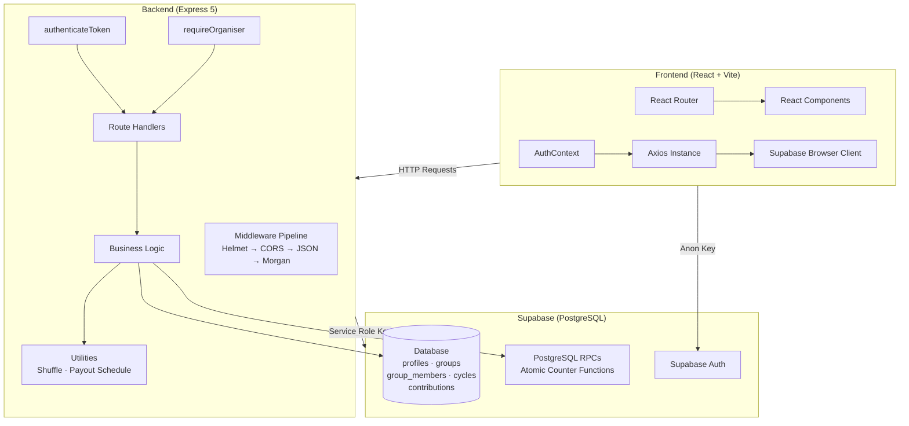
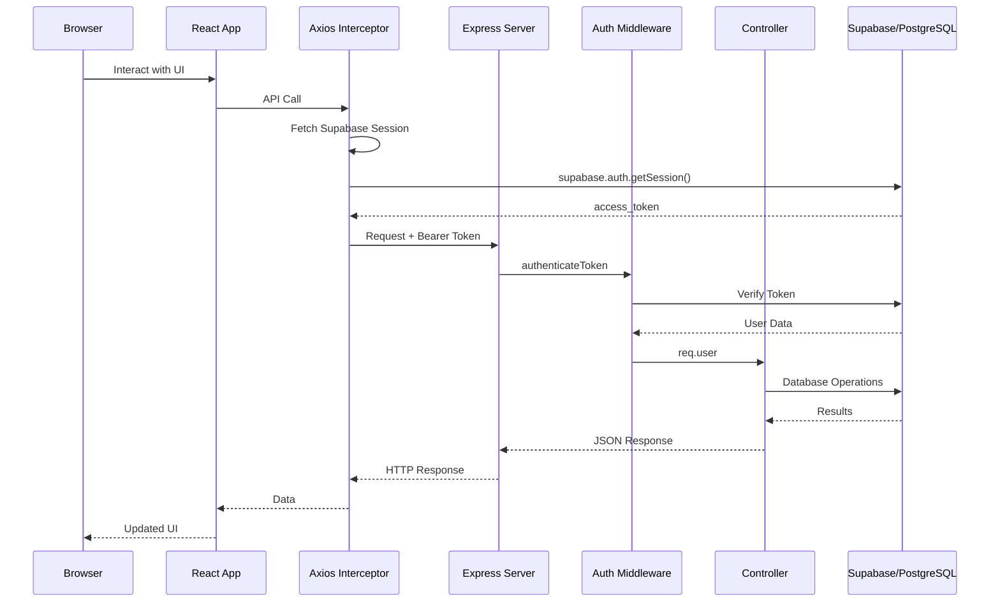
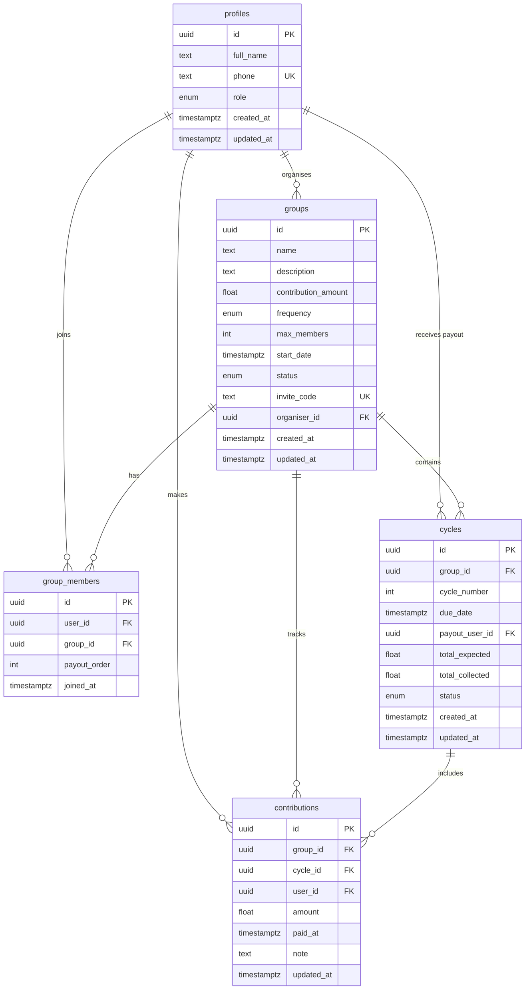

# Osusu

> **Digitising rotating savings groups (ROSCAs) for The Gambia.**

[](https://reactjs.org/)
[](https://vitejs.dev/)
[](https://expressjs.com/)
[](https://supabase.com/)
[](https://tailwindcss.com/)
[](https://nodejs.org/)
[](#license)

---

## Product Overview

Osusu is a full-stack web application that digitises **osusu** — traditional rotating savings and credit associations (ROSCAs) widely practised in The Gambia, West Africa. Members contribute a fixed amount on a regular schedule, and each member receives the full pooled pot in turn.

**The problem:** Traditional osusu groups rely on paper ledgers and verbal agreements. This creates disputes over payment records, lost paperwork, no audit trail, and difficulty scaling beyond a single neighbourhood.

**Our solution:** A transparent, mobile-friendly platform where organisers create groups, members join via invite codes, contributions are tracked in real time, and the entire payout schedule is automated. No more notebooks, no more disputes, no more trust issues.

### Target Users

- **Organisers** — group administrators who create and manage savings circles
- **Members** — participants who contribute and receive payouts
- **Community leaders** — individuals organising informal savings groups in their communities

---

## Features

### User-Facing Features

| Feature | Description |
|---|---|
| **Group Management** | Create, join, and manage rotating savings groups with unique invite codes |
| **Automated Payout Schedules** | Cycles are generated automatically with fair random payout order |
| **Contribution Tracking** | Organisers record member payments per cycle |
| **Dashboard Overview** | Real-time summary of active groups, contributions, and next due dates |
| **Profile Management** | Update personal information and change password |
| **Password Recovery** | Forgot password and reset password flows |

### Technical Features

| Feature | Description |
|---|---|
| **Atomic Counters** | Race-condition-free `total_collected` updates via PostgreSQL RPC functions |
| **Compensating Transactions** | Rollback mechanism on failed group activation ensures data consistency |
| **Unbiased Randomisation** | Fisher-Yates shuffle for fair payout order assignment |
| **State Machine Workflow** | Groups follow strict `FORMING → ACTIVE → COMPLETED` lifecycle |
| **Mobile-First Design** | Responsive UI that works on phones, tablets, and desktop |

### Security Features

| Feature | Description |
|---|---|
| **JWT Authentication** | Stateless token-based auth via Supabase Auth |
| **Role-Based Access Control** | Organiser-only endpoints protected by middleware |
| **Rate Limiting** | Auth endpoints limited to 20 requests per 15 minutes |
| **Input Validation** | All endpoints validate required fields and data types |
| **Email Enumeration Prevention** | Forgot password endpoint returns identical response regardless of email existence |
| **Request Size Limiting** | JSON body parser limited to 10KB |

---

## Architecture



### Request Lifecycle



---

## Tech Stack

| Technology | Purpose | Justification |
|---|---|---|
| **React 19** | Frontend framework | Component-based architecture, large ecosystem, excellent developer experience |
| **Vite 8** | Build tool | Fast HMR, optimised production builds, native ES module support |
| **Tailwind CSS 3** | Styling | Utility-first, rapid prototyping, consistent design system, small production bundle |
| **Axios** | HTTP client | Interceptor-based architecture cleanly separates auth token management |
| **Node.js 20** | Runtime | JavaScript full-stack consistency, excellent performance for I/O-bound workloads |
| **Express 5** | Web framework | Minimalist, well-tested, extensive middleware ecosystem |
| **Supabase** | Backend-as-a-Service | Managed PostgreSQL, built-in auth, real-time capabilities, generous free tier |
| **Supabase Auth** | Authentication | Email/password auth with JWT, password recovery, built-in session management |
| **react-hot-toast** | Notifications | Lightweight, declarative toast notifications with minimal configuration |

### Why No ORM?

The project intentionally avoids Prisma or any ORM. The Supabase JavaScript client provides a direct, type-safe interface to PostgreSQL that is more transparent and performant for this application's query patterns. Raw SQL for schema management gives complete control over database features like triggers, RPCs, and composite indexes that ORMs often abstract away.

---

## Project Structure

```
osusu/
├── client/                          # React + Vite frontend
│   ├── public/                      # Static assets (favicon, icons)
│   ├── src/
│   │   ├── api/                     # Axios instance + API modules
│   │   │   ├── axios.js             # Axios instance with Supabase token interceptor
│   │   │   └── groups.js            # Group-specific API helpers
│   │   ├── components/
│   │   │   ├── common/              # Reusable UI: Button, Input, Modal, Badge, Spinner
│   │   │   ├── groups/              # Group-specific: GroupCard, ContributionsTab, ScheduleTab
│   │   │   └── layout/              # Layout: Navbar, Footer, PageWrapper
│   │   ├── context/
│   │   │   └── AuthContext.jsx       # Global auth state management
│   │   ├── lib/
│   │   │   └── supabase.js          # Supabase browser client (anon key)
│   │   ├── pages/                   # Route-level page components
│   │   ├── utils/
│   │   │   └── helpers.js           # Currency/datetime formatting utilities
│   │   ├── App.jsx                  # React Router with route guards
│   │   ├── main.jsx                 # Application entry point
│   │   └── index.css                # Tailwind directives + custom styles
│   ├── index.html
│   ├── vite.config.js
│   ├── tailwind.config.js
│   ├── postcss.config.js
│   ├── eslint.config.js
│   └── package.json
│
├── server/                          # Node.js + Express backend
│   ├── sql/                         # Database schema & migrations
│   │   ├── schema.sql               # Full initial schema
│   │   ├── 001_add_daily_frequency.sql
│   │   ├── 002_add_cancelled_status.sql
│   │   └── 003_atomic_total_collected.sql
│   ├── src/
│   │   ├── controllers/             # Business logic (auth, groups, cycles, contributions)
│   │   ├── middleware/              # authenticateToken, requireOrganiser
│   │   ├── routes/                  # Route definitions
│   │   ├── utils/                   # Fisher-Yates shuffle, payout schedule generator
│   │   ├── lib/
│   │   │   └── supabase.js          # Supabase admin client (service role key)
│   │   └── app.js                   # Express app with middleware pipeline
│   ├── server.js                    # Server entry point
│   ├── .env                         # Environment variables (gitignored)
│   └── package.json
│
├── docs/                            # Comprehensive documentation
├── OsusuApp_Build_Spec_Supabase.md  # Build specification
├── AGENTS.md                        # OpenCode agent instructions
└── README.md
```

---

## Installation Guide

### Prerequisites

- **Node.js 20+** — [Download](https://nodejs.org/)
- **npm** — Comes with Node.js
- **Supabase account** — [Free tier](https://supabase.com/) works perfectly
- **Git** — For version control

### Clone the Repository

```bash
git clone <repo-url>
cd osusu
```

### Install Dependencies

```bash
# Backend
cd server && npm install

# Frontend
cd ../client && npm install
```

### Database Setup

1. Create a new Supabase project at [supabase.com](https://supabase.com)
2. Navigate to **SQL Editor** in the Supabase dashboard
3. Open `server/sql/schema.sql` and run the entire file
4. (Optional) Run migration files in order if updating an existing database:
   - `server/sql/001_add_daily_frequency.sql`
   - `server/sql/002_add_cancelled_status.sql`
   - `server/sql/003_atomic_total_collected.sql`
5. Verify all tables appear in the **Table Editor**

### Environment Variables

**Server** (`server/.env`):

```env
PORT=5000
SUPABASE_URL=https://your-project.supabase.co
SUPABASE_SERVICE_ROLE_KEY=your-service-role-key
CLIENT_URL=http://localhost:5173
```

**Client** (`client/.env.local`):

```env
VITE_SUPABASE_URL=https://your-project.supabase.co
VITE_SUPABASE_ANON_KEY=your-anon-key
VITE_API_URL=http://localhost:5000/api
```

> Find these values in: Supabase Dashboard → Project Settings → API

### Run Locally

```bash
# Terminal 1 — Start the backend
cd server
npm run dev

# Terminal 2 — Start the frontend
cd client
npm run dev
```

Open **http://localhost:5173** in your browser.

### Troubleshooting

| Problem | Solution |
|---|---|
| `PORT already in use` | Change `PORT` in `server/.env` or kill the existing process |
| CORS errors in browser | Verify `CLIENT_URL` in `server/.env` matches your frontend URL |
| Auth errors | Confirm `SUPABASE_URL` and keys are correct in both `.env` files |
| Database query errors | Ensure `schema.sql` was run successfully in the Supabase SQL Editor |
| Token issues | Clear browser localStorage and re-login |

---

## Environment Variables

### Server Variables

| Variable | Purpose | Example | Security |
|---|---|---|---|
| `PORT` | Express server port | `5000` | — |
| `SUPABASE_URL` | Supabase project URL | `https://xyz.supabase.co` | Public in Supabase settings |
| `SUPABASE_SERVICE_ROLE_KEY` | Admin access (bypasses RLS) | `eyJ...` | **CRITICAL — never expose to client** |
| `CLIENT_URL` | Allowed CORS origin | `http://localhost:5173` | Match your frontend URL exactly |

### Client Variables

| Variable | Purpose | Example | Security |
|---|---|---|---|
| `VITE_SUPABASE_URL` | Supabase project URL | `https://xyz.supabase.co` | Public — embedded in frontend bundle |
| `VITE_SUPABASE_ANON_KEY` | Public anon key | `eyJ...` | Public — respects RLS policies |
| `VITE_API_URL` | Backend API base URL | `http://localhost:5000/api` | Points to your Express server |

---

## Database Schema



The database uses 5 tables with `snake_case` naming conventions. See [Database Design](./docs/database-design.md) for complete schema documentation including triggers, RPCs, indexes, and atomic operations.

---

## API Overview

**Base URL:** `/api`  
**Auth:** `Authorization: Bearer <supabase_access_token>` (on protected routes)  
**Response Envelope:**

```json
// Success
{ "success": true, "data": { ... } }

// Error
{ "success": false, "error": { "message": "Description" } }
```

### Status Codes

| Code | Meaning |
|---|---|
| 200 | Success |
| 201 | Created |
| 400 | Validation error |
| 401 | Unauthorised |
| 403 | Forbidden |
| 404 | Not found |
| 409 | Conflict |
| 500 | Server error |

### Auth Routes (`/api/auth`)

| Method | Path | Auth | Description |
|---|---|---|---|
| POST | `/auth/register` | No | Create account |
| POST | `/auth/login` | No | Sign in |
| POST | `/auth/forgot-password` | No | Request password reset |
| POST | `/auth/reset-password` | No | Reset password with token |
| GET | `/auth/me` | Yes | Get current profile |
| PUT | `/auth/profile` | Yes | Update profile |
| POST | `/auth/change-password` | Yes | Change password |

### Group Routes (`/api/groups`)

| Method | Path | Auth | Description |
|---|---|---|---|
| POST | `/groups` | Yes | Create group |
| GET | `/groups/my` | Yes | List user's groups |
| POST | `/groups/join` | Yes | Join via invite code |
| GET | `/groups/:id` | Yes | Group details |
| POST | `/groups/:id/start` | Yes+Organiser | Activate group |
| PUT | `/groups/:id/cancel` | Yes+Organiser | Cancel active group |
| DELETE | `/groups/:id` | Yes+Organiser | Delete forming group |
| GET | `/groups/:id/schedule` | Yes | Payout schedule |
| GET | `/groups/:id/members` | Yes | Member list |

### Contribution Routes (`/api/contributions`)

| Method | Path | Auth | Description |
|---|---|---|---|
| POST | `/contributions` | Yes+Organiser | Record payment |
| GET | `/contributions/group/:groupId` | Yes | Group contributions |
| GET | `/contributions/my` | Yes | My contributions |
| DELETE | `/contributions/:id` | Yes+Organiser | Delete contribution |

### Cycle Routes (`/api/cycles`)

| Method | Path | Auth | Description |
|---|---|---|---|
| GET | `/cycles/group/:groupId` | Yes | Group cycles |
| GET | `/cycles/:id` | Yes | Cycle detail |
| PUT | `/cycles/:id/complete` | Yes+Organiser | Complete cycle |

See [API Reference](./docs/api-reference.md) for complete endpoint documentation with request/response examples.

---

## Authentication Flow

Osusu uses **Supabase Auth** for authentication, integrated with the Express backend:

1. **Registration/Login:** The frontend sends credentials to the Express server, which proxies to Supabase Auth
2. **Token Synchronisation:** After a successful auth response, the `access_token` and `refresh_token` are synced into the browser's Supabase client via `supabase.auth.setSession()`
3. **Automatic Token Attachment:** The Axios interceptor fetches the current session on every request and attaches it as a `Bearer` token
4. **Token Verification:** The `authenticateToken` middleware validates each request's JWT against Supabase Auth
5. **Session Persistence:** Supabase handles token refresh automatically; the Axios response interceptor redirects to login on 401 errors

See [Authentication](./docs/authentication.md) for complete flow documentation.

---

## Security

| Layer | Measure | Implementation |
|---|---|---|
| **Transport** | HTTP security headers | `helmet()` middleware |
| **Transport** | CORS restriction | Only `CLIENT_URL` origin allowed |
| **Request** | Body size limit | 10KB maximum payload |
| **Request** | Rate limiting | 20 requests/15 min on auth routes |
| **Authentication** | JWT verification | `supabaseAdmin.auth.getUser()` on every request |
| **Authentication** | Token storage | Supabase-managed session, not manual localStorage |
| **Authorization** | Organiser guard | `requireOrganiser` middleware on critical endpoints |
| **Authorization** | Membership check | Group detail verifies caller is a member |
| **Database** | Atomic operations | PostgreSQL RPC functions prevent race conditions |
| **Database** | Compensating actions | Rollback on failed group activation |
| **Business Logic** | Email enumeration prevention | Identical response for all forgot-password requests |
| **Business Logic** | Input validation | All controllers validate required fields and formats |

---

## Deployment

### Database (Supabase)

Schema is created via the Supabase SQL Editor. No migration commands needed — Supabase manages the database.

### Backend (Render)

```bash
# Build command
npm install

# Start command
node server.js
```

Set environment variables: `SUPABASE_URL`, `SUPABASE_SERVICE_ROLE_KEY`, `PORT`, `CLIENT_URL`

### Frontend (Vercel)

1. Framework preset: **Vite**
2. Root directory: `client`
3. Environment variables: `VITE_SUPABASE_URL`, `VITE_SUPABASE_ANON_KEY`, `VITE_API_URL`

See `DEPLOYMENT.md` for full deployment instructions.

**Short version:**
- Backend → Render (root: `server`, start: `node server.js`)
- Frontend → Vercel (root: `client`, framework: Vite)

---

## Engineering Decisions

| Decision | Rationale |
|---|---|
| **No ORM** | Supabase JS client provides direct PostgreSQL access without ORM abstraction overhead; raw SQL gives complete control over triggers, RPCs, and indexes |
| **Supabase** | Managed PostgreSQL with built-in auth, real-time capabilities, generous free tier — ideal for an MVP |
| **Express 5** | Minimalist, well-tested, massive ecosystem; v5 adds native async error handling |
| **React + Vite** | Industry-standard frontend stack with excellent DX, fast HMR, and optimised builds |
| **Atomic Counters** | PostgreSQL RPCs prevent race conditions on `total_collected` — critical for financial accuracy |
| **Service Role Key** | Server uses admin key to bypass RLS; all application-level authorization is handled in middleware |
| **Fisher-Yates Shuffle** | Unbiased random permutation ensures fair payout order for all members |
| **Compensating Transactions** | Manual rollback in `startGroup` ensures consistency without a full transaction manager |

---

## Future Improvements

- **Real-time notifications** — WebSocket or push notifications for payment reminders
- **Mobile app** — React Native wrapper for native mobile experience
- **Payment integration** — Mobile money (Orange Money, Wave) integration for The Gambia
- **Admin dashboard** — Super-admin panel for platform oversight
- **Analytics** — Savings patterns, group health metrics, member retention
- **Multi-region** — Support for different currencies and ROSCA conventions across West Africa

See [Future Improvements](./docs/future-improvements.md) for a comprehensive roadmap.

---

## Academic Context

This project was developed as a final-year computer science project demonstrating:

- **Full-stack web development** with modern JavaScript technologies
- **Database design** with PostgreSQL, including triggers, RPCs, and atomic operations
- **Authentication and authorisation** patterns with JWT and role-based access control
- **Security best practices** including input validation, rate limiting, and CSRF prevention
- **Software engineering principles** including separation of concerns, middleware patterns, and compensating transactions

See [Final Year Report Summary](./docs/final-year-report-summary.md) for the complete academic context.

---

## Contributing

1. Fork the repository
2. Create a feature branch (`git checkout -b feature/amazing-feature`)
3. Commit your changes (`git commit -m 'Add amazing feature'`)
4. Push to the branch (`git push origin feature/amazing-feature`)
5. Open a Pull Request

### Development Standards

- Frontend: Follow existing component patterns and Tailwind conventions
- Backend: Maintain consistent error response envelopes and middleware patterns
- Database: Add migrations as SQL files in `server/sql/`
- Documentation: Update relevant docs for any API or schema changes

---

## License

Private — built for The Gambia.

---

<div align="center">
  <strong>Built with care for The Gambia.</strong><br>
  <em>Digitising tradition, one contribution at a time.</em>
</div>
