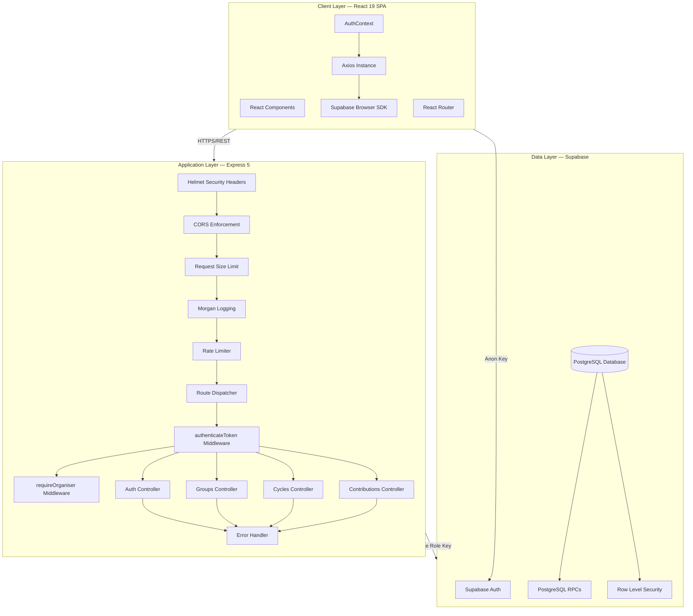
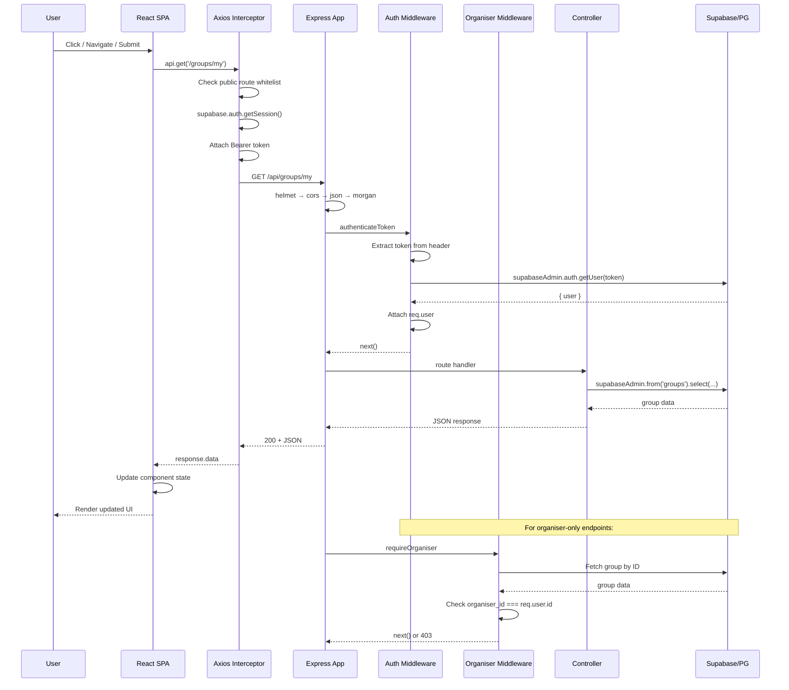
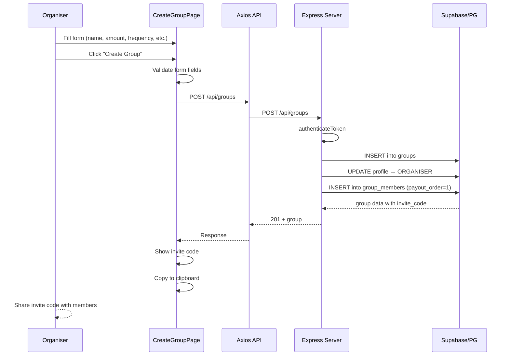
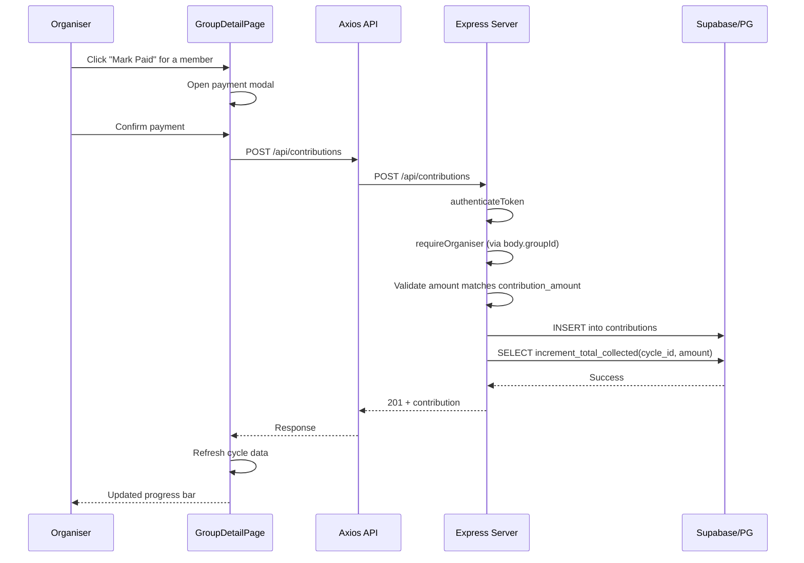

# System Architecture

## Overview

Osusu is a full-stack web application built on a **monolithic architecture** with a clear separation between frontend and backend. The frontend is a single-page application (SPA) that communicates with a RESTful API backend, which in turn interfaces with a managed PostgreSQL database through Supabase.

The architecture follows a **three-tier** pattern:

```
┌──────────────┐     ┌──────────────┐     ┌──────────────────┐
│  Presentation │────▶│  Application  │────▶│     Data         │
│  (React SPA) │     │  (Express 5)  │     │  (Supabase/PG)   │
└──────────────┘     └──────────────┘     └──────────────────┘
```

---

## High-Level Architecture



---

## Request Lifecycle



---

## Design Patterns

### 1. Middleware Pipeline Pattern

Express middleware chains are used to compose request processing:

```
Request → helmet → cors → json parser → morgan → rate limiter → router → auth → organiser → controller → response
```

Each middleware has a single responsibility and is independently testable.

### 2. Controller-Service Pattern

While not using explicit service classes, the architecture separates:

- **Routes** — URL mapping and middleware composition
- **Controllers** — Business logic, validation, and database orchestration
- **Middleware** — Cross-cutting concerns (auth, authorisation)
- **Utilities** — Pure functions (shuffle, schedule generation)

### 3. State Machine Pattern

Groups and cycles follow strict state machine transitions:

```
Groups:     FORMING ──► ACTIVE ──► COMPLETED
                 │                    ▲
                 └── DELETE            │
                                     CANCELLED

Cycles:     PENDING ──► COLLECTING ──► PAID_OUT
```

Transitions are enforced in controller logic, preventing invalid state changes.

### 4. Compensating Transaction Pattern

The `startGroup` function implements manual compensation for multi-step operations:

1. Update payout orders in database
2. Generate and insert cycles
3. Update group status to ACTIVE

If step 2 fails, payout orders are restored. If step 3 fails, both payout orders are restored AND cycles are deleted. This ensures no partial updates exist.

### 5. Observer Pattern (Frontend)

The `AuthContext` subscribes to Supabase auth state changes via `onAuthStateChange`, allowing the entire UI to reactively adapt to auth events (sign in, sign out, token refresh, password recovery).

### 6. Interceptor Pattern (Frontend)

The Axios instance uses request/response interceptors to:

- Automatically attach auth tokens (request interceptor)
- Handle 401 responses globally (response interceptor)
- Keep individual API modules free of auth boilerplate

---

## Monolithic Architecture Decision

The application uses a **monolithic architecture** — one Express server handling all API routes. This was chosen because:

### Advantages
- **Simpler deployment** — Single process to deploy and monitor
- **Lower latency** — No inter-service network calls
- **Easier development** — Single codebase, shared types, atomic deployments
- **Transaction consistency** — Easier to maintain data integrity without distributed transactions
- **MVP-appropriate** — For the current scale (single-university project), monolith is the pragmatic choice

### When to Consider Microservices

- When the user base grows beyond thousands of active groups
- When independent scaling is needed (e.g., notification service vs. core API)
- When different teams need to own different domains
- When specialised infrastructure is needed (e.g., real-time WebSocket server)

### Migration Path

For future microservices migration, the controller-based structure already provides natural bounded contexts:

- `auth.controller.js` → Auth Service
- `groups.controller.js` → Groups Service
- `cycles.controller.js` → Cycles Service
- `contributions.controller.js` → Contributions Service

Each would become its own Express app with its own database schema and API surface.

---

## Data Flow Diagrams

### Group Creation Flow



### Contribution Recording Flow



---

## Component Interaction

### Frontend-Backend Communication

| Aspect | Implementation |
|---|---|
| **Protocol** | HTTP/HTTPS |
| **Data Format** | JSON |
| **Authentication** | Bearer JWT in `Authorization` header |
| **CORS** | Configured server-side to accept only `CLIENT_URL` |
| **Error Format** | Consistent `{ success, error: { message } }` envelope |

### Frontend-Supabase Communication

| Aspect | Implementation |
|---|---|
| **Auth Operations** | Via Express backend (proxied to Supabase) |
| **Session Management** | Supabase browser SDK (`supabase.auth.getSession()`, `onAuthStateChange`) |
| **Token Operations** | `setSession()` after login/register |

---

## Performance Considerations

### Current Optimisations

- **Database indexes** — 6 composite/single-column indexes on frequently queried foreign keys
- **Atomic RPCs** — Single-statement PostgreSQL functions for counter updates (no read-modify-write round trips)
- **Request validation** — Early rejection of invalid requests before database operations
- **Body size limit** — 10KB maximum payload prevents abuse
- **Response shaping** — Controllers return only required fields (no over-fetching)

### Bottlenecks

- **Single server** — No horizontal scaling for the Express API
- **No caching** — Every request hits the database directly
- **No connection pooling tuning** — Default Supabase client pool configuration
- **Synchronous operations** — No background job queue for non-critical operations
