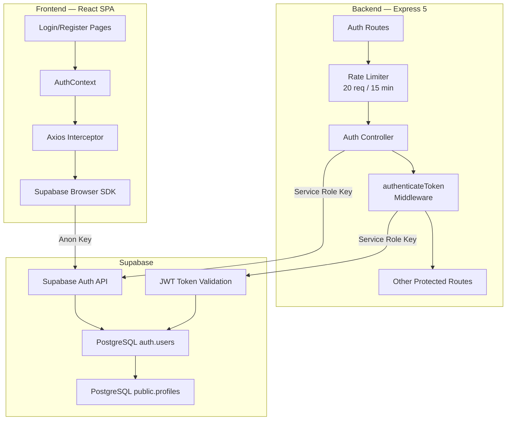
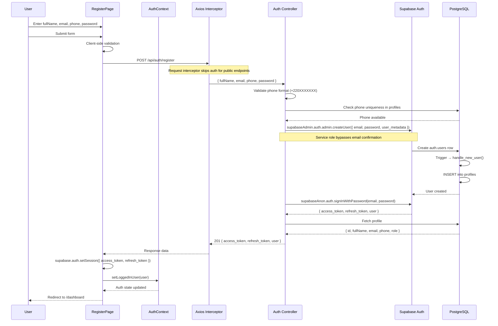
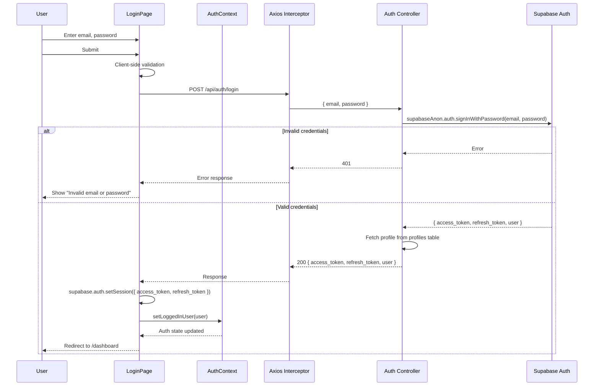
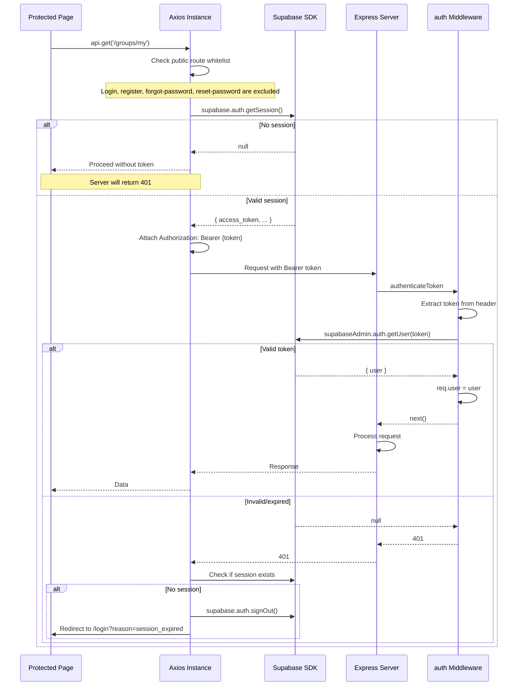
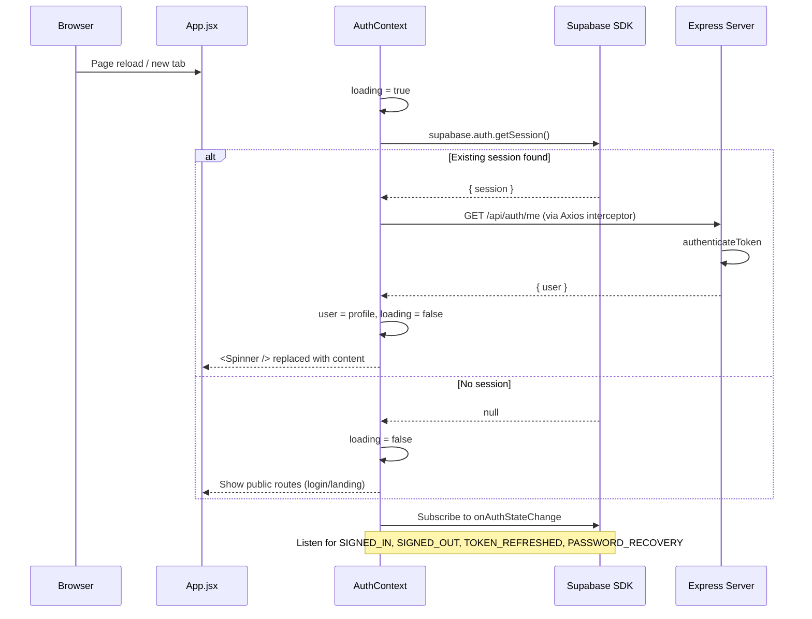
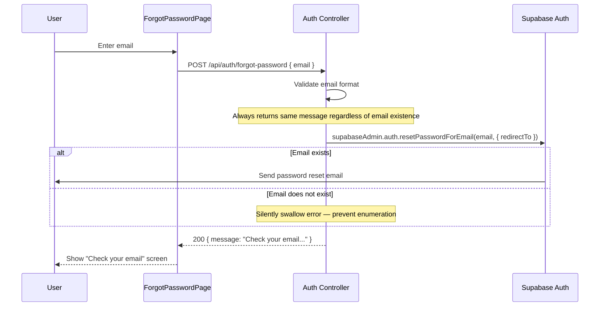
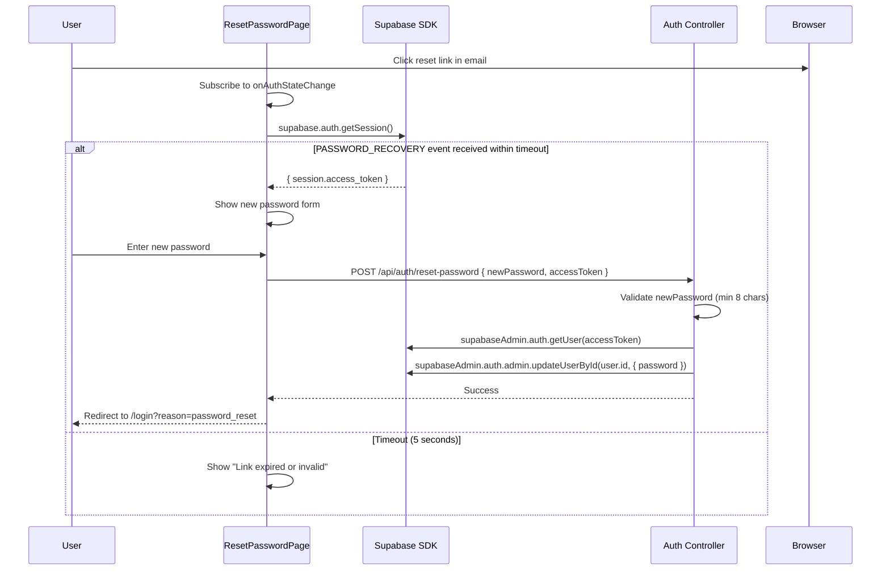

# Authentication Architecture

## Overview

Osusu uses **Supabase Auth** as the authentication provider, integrated with a custom Express backend. Authentication is stateless using JSON Web Tokens (JWTs), with the frontend managing session state through the Supabase browser SDK.

This document explains the complete authentication flow from registration through daily session management.

---

## Architecture

---

## Authentication Flows

### 1. Registration Flow

**Key details:**
- Phone is checked **before** user creation to provide specific feedback
- `supabaseAdmin.auth.admin.createUser()` with `email_confirm: true` skips email confirmation
- A database trigger automatically inserts the `profiles` row
- The server has a fallback that manually checks/inserts the profile
- After registration, the user is immediately signed in (no email verification required)

### 2. Login Flow

### 3. Authenticated Request Flow

### 4. Session Restoration on Page Load

### 5. Forgot Password Flow

### 6. Reset Password Flow

---

## Token Management

### Why a Custom Auth Backend?

Supabase Auth can be used directly from the browser, but Osusu uses a custom Express backend for:

1. **Additional validation** — Phone format enforcement, duplicate phone checking
2. **Token synchronisation control** — Explicit `setSession()` call after auth
3. **Profile enrichment** — Returning combined auth + profile data
4. **Rate limiting** — Server-defined limits on auth endpoints
5. **Future extensibility** — Easy to add custom auth logic (2FA, device management)

### Token Flow

| Step | Action | Component |
|---|---|---|
| 1 | User submits credentials | LoginPage / RegisterPage |
| 2 | Server authenticates via Supabase | Auth Controller |
| 3 | Tokens returned to frontend | API Response |
| 4 | Tokens synced to Supabase SDK | `supabase.auth.setSession()` |
| 5 | Token attached to every request | Axios request interceptor |
| 6 | Token verified server-side | `authenticateToken` middleware |
| 7 | Auto-refresh on expiry | Supabase SDK handles transparently |
| 8 | On 401, check and redirect | Axios response interceptor |

### Security Considerations

| Consideration | Implementation |
|---|---|
| **Token storage** | Supabase SDK manages tokens in memory + localStorage. AGENTS.md states "Do not use localStorage" but this refers to manual token management, not the SDK's internal persistence. |
| **Token exposure** | Tokens are sent only in `Authorization` headers (never in URLs or body) |
| **Token lifetime** | Supabase access tokens expire after 1 hour; refresh tokens handle silent renewal |
| **Service role key** | Never exposed to the frontend — only used server-side |
| **Session persistence** | `supabase.auth.setSession()` stores tokens so `getSession()` returns them on page reload |

---

## Route Protection

### Frontend Route Guards

Three guard patterns are used in `App.jsx`:

| Guard | Behavior |
|---|---|
| `ProtectedRoute` | If `loading`, show spinner. If no `user`, redirect to `/login`. Otherwise render children. |
| `PublicRoute` | If `loading`, show spinner. If `user` exists, redirect to `/dashboard`. Otherwise render children. |
| `HomeRoute` | If `loading`, show spinner. If `user`, redirect to `/dashboard`. Otherwise render `<LandingPage />`. |

### Backend Route Protection

| Level | Mechanism | Scope |
|---|---|---|
| **All data routes** | `authenticateToken` middleware | `/api/groups/*`, `/api/contributions/*`, `/api/cycles/*`, some `/api/auth/*` |
| **Organiser-only** | `requireOrganiser` middleware | POST DELETE `/groups/:id`, PUT `/groups/:id/cancel`, POST `/groups/:id/start`, POST `/contributions`, PUT `/cycles/:id/complete` |
| **Rate-limited** | `rateLimit({ windowMs, max: 20 })` | All `/api/auth/*` endpoints |
| **Unprotected** | None | GET `/api/health`, POST `/api/auth/login`, POST `/api/auth/register`, POST `/api/auth/forgot-password`, POST `/api/auth/reset-password` |

---

## Error States

| Scenario | HTTP Status | Frontend Behaviour |
|---|---|---|
| Invalid email/password | 401 | Show "Invalid email or password" |
| Email already registered | 409 | Show "An account with this email already exists" |
| Phone already registered | 409 | Show "Phone number already in use" |
| Invalid phone format | 400 | Show "Phone must be in +220XXXXXXX format" |
| Weak password | 400 | Show "Password must be at least 8 characters" |
| Session expired | 401 + no session | Redirect to `/login?reason=session_expired` |
| Unexpected server error | 500 | Show "Something went wrong. Please try again." |
