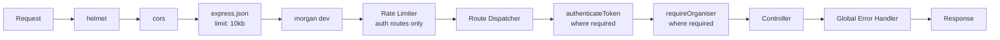
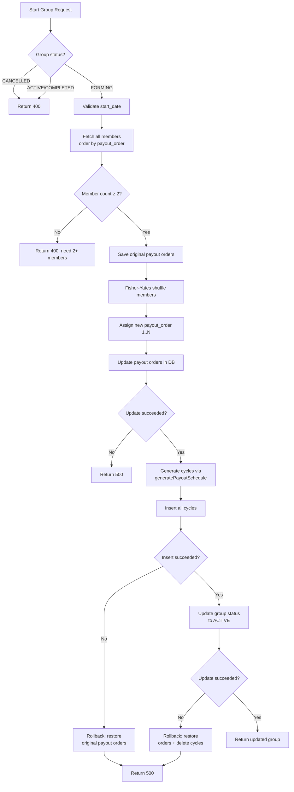
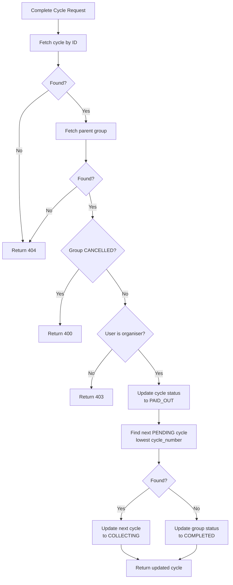

# Backend Architecture

## Overview

The Osusu backend is a **Node.js + Express 5** REST API that handles all business logic, authentication, and database operations. It serves as the authoritative data layer between the React frontend and Supabase (PostgreSQL).

---

## Application Structure

```
server/
├── server.js                    # Entry point
├── src/
│   ├── app.js                   # Express app setup & middleware pipeline
│   ├── controllers/
│   │   ├── auth.controller.js
│   │   ├── groups.controller.js
│   │   ├── cycles.controller.js
│   │   └── contributions.controller.js
│   ├── routes/
│   │   ├── auth.routes.js
│   │   ├── groups.routes.js
│   │   ├── cycles.routes.js
│   │   └── contributions.routes.js
│   ├── middleware/
│   │   ├── auth.js               # JWT authentication
│   │   └── requireOrganiser.js   # Role-based access control
│   ├── lib/
│   │   └── supabase.js           # Supabase clients (admin + anon)
│   └── utils/
│       ├── shuffle.js            # Fisher-Yates shuffle
│       └── generatePayoutSchedule.js  # Cycle schedule generator
└── sql/
    ├── schema.sql                # Full database schema
    ├── 001_add_daily_frequency.sql
    ├── 002_add_cancelled_status.sql
    └── 003_atomic_total_collected.sql
```

---

## Entry Point (`server.js`)

```js
require('dotenv').config();
const app = require('./src/app');
const PORT = process.env.PORT || 5000;
app.listen(PORT, () => console.log(`Server listening on port ${PORT}`));
```

Standard Node.js entry point. Loads environment variables first, then starts the Express app on the configured port.

---

## Express App Setup (`src/app.js`)

### Middleware Pipeline (Execution Order)



| Order | Middleware | Purpose | Scope |
|---|---|---|---|
| 1 | `helmet()` | Set secure HTTP headers (X-Frame-Options, X-XSS-Protection, etc.) | All routes |
| 2 | `cors({ origin: CLIENT_URL, credentials: true })` | Allow only the frontend origin | All routes |
| 3 | `express.json({ limit: '10kb' })` | Parse JSON bodies, prevent large payload attacks | All routes |
| 4 | `morgan('dev')` | Log HTTP requests (`:method :url :status :response-time ms`) | All routes |
| 5 | `rateLimit({ windowMs: 15min, max: 20 })` | Prevent brute force on auth | `/api/auth/*` only |
| 6 | Route handlers | Dispatch to controllers | Per route |
| 7 | `authenticateToken` | Validate JWT | Protected routes |
| 8 | `requireOrganiser` | Check group ownership | Organiser-only routes |
| 9 | Global error handler | Catch unhandled errors (500) | All routes |

### Route Mounting

| Prefix | Router | Auth Required? |
|---|---|---|
| `GET /api/health` | Inline handler | No |
| `/api/auth` | `auth.routes.js` | Mixed (register/login are public) |
| `/api/groups` | `groups.routes.js` | **Yes** (router-level) |
| `/api/contributions` | `contributions.routes.js` | **Yes** (router-level) |
| `/api/cycles` | `cycles.routes.js` | **Yes** (router-level) |

### Global Error Handler

```js
app.use((err, req, res, next) => {
  console.error(err.stack);
  res.status(500).json({
    success: false,
    error: { message: 'Internal server error' }
  });
});
```

Serves as a safety net for unhandled errors. Logs the stack trace server-side but returns only a generic message to the client.

---

## Routing Architecture

Routes are kept thin — they define HTTP method + path + middleware composition, then delegate to controllers.

### `auth.routes.js`

```js
const router = require('express').Router();
const rateLimit = require('express-rate-limit');
const { register, login, ... } = require('../controllers/auth.controller');

const authLimiter = rateLimit({ windowMs: 15 * 60 * 1000, max: 20 });

router.post('/register', authLimiter, register);
router.post('/login', authLimiter, login);
router.post('/forgot-password', authLimiter, forgotPassword);
router.post('/reset-password', authLimiter, resetPassword);
router.get('/me', authenticateToken, getMe);
router.put('/profile', authenticateToken, updateProfile);
router.post('/change-password', authenticateToken, changePassword);

module.exports = router;
```

### `groups.routes.js`

```js
const router = require('express').Router();
const { authenticateToken } = require('../middleware/auth');
const { requireOrganiser } = require('../middleware/requireOrganiser');
const { createGroup, getMyGroups, ... } = require('../controllers/groups.controller');

router.use(authenticateToken);  // All group routes require auth

router.post('/', createGroup);
router.get('/my', getMyGroups);
router.post('/join', joinGroup);
router.get('/:id', getGroupById);
router.post('/:id/start', requireOrganiser, startGroup);
router.put('/:id/cancel', requireOrganiser, cancelGroup);
router.delete('/:id', requireOrganiser, deleteGroup);
router.get('/:id/schedule', getGroupSchedule);
router.get('/:id/members', getGroupMembers);

module.exports = router;
```

### `cycles.routes.js`

```js
const router = require('express').Router();
const { authenticateToken } = require('../middleware/auth');
const { requireOrganiser } = require('../middleware/requireOrganiser');
const { getCyclesByGroup, getCycleById, completeCycle } = require('../controllers/cycles.controller');

router.use(authenticateToken);

router.get('/group/:groupId', getCyclesByGroup);
router.get('/:id', getCycleById);
router.put('/:id/complete', requireOrganiser, completeCycle);

module.exports = router;
```

### `contributions.routes.js`

```js
const router = require('express').Router();
const { authenticateToken } = require('../middleware/auth');
const { requireOrganiser } = require('../middleware/requireOrganiser');
const { createContribution, getGroupContributions, ... } = require('../controllers/contributions.controller');

router.use(authenticateToken);

router.post('/', requireOrganiser, createContribution);
router.get('/group/:groupId', getGroupContributions);
router.get('/my', getMyContributions);
router.delete('/:id', deleteContribution);  // Organiser check inside controller

module.exports = router;
```

---

## Middleware

### `authenticateToken` (`src/middleware/auth.js`)

Validates JWT on protected routes using Supabase Auth.

**Logic:**
1. Extract `Authorization` header
2. Parse `Bearer <token>` format
3. Return 401 if no token
4. Call `supabaseAdmin.auth.getUser(token)` to verify
5. Return 401 if invalid/expired
6. Attach `req.user = user` and call `next()`

**Key detail:** Uses the **service role client** for token verification, not the anon client. This ensures reliable validation regardless of the token's origin.

### `requireOrganiser` (`src/middleware/requireOrganiser.js`)

Restricts group operations to the group's organiser.

**Logic:**
1. Determine `groupId` from `req.params.groupId`, `req.params.id`, or `req.body.groupId`
2. Fetch group from database
3. Return 404 if not found
4. Return 403 if `group.organiser_id !== req.user.id`
5. Attach `req.group = group` and call `next()`

**Flexibility:** Accepts group ID from multiple sources (route params, request body) to support different endpoint conventions.

---

## Controllers

### Auth Controller (`src/controllers/auth.controller.js`)

| Function | Endpoint | Key Logic |
|---|---|---|
| `register` | POST `/auth/register` | Validate phone format, check phone uniqueness, create user via Supabase admin, sign in, return tokens |
| `login` | POST `/auth/login` | Sign in via Supabase, fetch profile, return tokens |
| `getMe` | GET `/auth/me` | Fetch profile from `profiles` table using `req.user.id` |
| `updateProfile` | PUT `/auth/profile` | Update `fullName` and/or `phone` in `profiles` |
| `changePassword` | POST `/auth/change-password` | Update password via `supabaseAdmin.auth.admin.updateUserById()` |
| `forgotPassword` | POST `/auth/forgot-password` | Send reset email via Supabase; always returns same message |
| `resetPassword` | POST `/auth/reset-password` | Validate reset token, update password |

**Phone validation:** Uses `/^\+220[0-9]{7}$/` — strict Gambian phone format. Returns 400 for invalid format.

**Email enumeration prevention:** `forgotPassword` always returns `200 { message: "Check your email..." }` regardless of whether the email exists. Errors are swallowed silently.

### Groups Controller (`src/controllers/groups.controller.js`)

The most complex controller (500 lines) managing the complete group lifecycle.

| Function | Endpoint | Key Logic |
|---|---|---|
| `createGroup` | POST `/groups` | Insert group, promote creator to ORGANISER, add as member #1 |
| `getMyGroups` | GET `/groups/my` | Query `group_members` joined with `groups` |
| `getGroupById` | GET `/groups/:id` | Verify membership, fetch members + current cycle + organiser |
| `joinGroup` | POST `/groups/join` | Validate invite code, check status, check capacity, check duplicates |
| `startGroup` | POST `/groups/:id/start` | **Core complexity:** shuffle members, generate schedule, insert cycles, update status, with compensating rollbacks |
| `cancelGroup` | PUT `/groups/:id/cancel` | Soft-delete: set status to CANCELLED, preserve records |
| `deleteGroup` | DELETE `/groups/:id` | Hard-delete: only allowed for FORMING groups |
| `getGroupSchedule` | GET `/groups/:id/schedule` | All cycles with payout user profile |
| `getGroupMembers` | GET `/groups/:id/members` | Members with profiles, ordered by payout order |

#### `startGroup` — Detailed Flow



### Cycles Controller (`src/controllers/cycles.controller.js`)

| Function | Endpoint | Key Logic |
|---|---|---|
| `getCyclesByGroup` | GET `/cycles/group/:groupId` | All cycles for a group with payout user profile |
| `getCycleById` | GET `/cycles/:id` | Single cycle with contributions + payer names |
| `completeCycle` | PUT `/cycles/:id/complete` | Mark PAID_OUT, auto-advance next cycle or complete group |

#### `completeCycle` — State Machine



### Contributions Controller (`src/contributions/controller.js`)

| Function | Endpoint | Key Logic |
|---|---|---|
| `createContribution` | POST `/contributions` | Validate organiser, amount, cycle, membership; insert + atomic increment |
| `getGroupContributions` | GET `/contributions/group/:groupId` | All contributions with payer profiles |
| `getMyContributions` | GET `/contributions/my` | Current user's contributions with group/cycle info |
| `deleteContribution` | DELETE `/contributions/:id` | Verify organiser, delete + atomic decrement |

#### `createContribution` — Validation Chain

1. Validate request body (groupId, cycleId, userId, amount > 0)
2. Fetch group → verify `contribution_amount` matches, verify organiser status
3. Reject if group is `CANCELLED`
4. Fetch cycle → verify it belongs to the group
5. Fetch member → verify `userId` is in the group
6. Insert contribution → handle `23505` (duplicate) → atomic increment `total_collected`

---

## Supabase Client (`src/lib/supabase.js`)

Two clients are created:

| Client | Key | Uses | Config |
|---|---|---|---|
| `supabaseAdmin` | `SUPABASE_SERVICE_ROLE_KEY` | All DB operations, token verification, auth admin | `autoRefreshToken: false`, `persistSession: false` |
| `supabaseAnon` | `SUPABASE_ANON_KEY` | Only `signInWithPassword()` during login/register | `autoRefreshToken: false`, `persistSession: false` |

```js
const { createClient } = require('@supabase/supabase-js');

const supabaseAdmin = createClient(
  process.env.SUPABASE_URL,
  process.env.SUPABASE_SERVICE_ROLE_KEY,
  { auth: { autoRefreshToken: false, persistSession: false } }
);

const supabaseAnon = createClient(
  process.env.SUPABASE_URL,
  process.env.SUPABASE_ANON_KEY,
  { auth: { autoRefreshToken: false, persistSession: false } }
);

module.exports = { supabaseAdmin, supabaseAnon };
```

---

## Utilities

### `shuffle.js` — Fisher-Yates (Knuth) Shuffle

Unbiased random permutation algorithm for payout order randomisation:

```js
function shuffle(array) {
  const arr = [...array];
  for (let i = arr.length - 1; i > 0; i--) {
    const j = Math.floor(Math.random() * (i + 1));
    [arr[i], arr[j]] = [arr[j], arr[i]];
  }
  return arr;
}
```

**Why Fisher-Yates?** Unlike `arr.sort(() => Math.random() - 0.5)`, Fisher-Yates produces a truly unbiased shuffle where every permutation is equally likely.

### `generatePayoutSchedule.js` — Cycle Schedule Generator

Generates one cycle per member in payout rotation order:

```js
function generatePayoutSchedule(group, members) {
  const sorted = [...members].sort((a, b) => a.payout_order - b.payout_order);
  const cycles = [];
  let cycleDate = new Date(group.start_date);

  for (let i = 0; i < sorted.length; i++) {
    cycles.push({
      group_id: group.id,
      cycle_number: i + 1,
      due_date: new Date(cycleDate),
      payout_user_id: sorted[i].user_id,
      total_expected: group.contribution_amount * sorted.length,
      total_collected: 0,
      status: i === 0 ? 'COLLECTING' : 'PENDING',
    });
    cycleDate = addInterval(cycleDate, group.frequency);
  }
  return cycles;
}
```

**Date interval logic:**

| Frequency | Interval | Edge Case Handling |
|---|---|---|
| `DAILY` | +1 day | — |
| `WEEKLY` | +7 days | — |
| `MONTHLY` | +1 month | Clamped to last day of month if needed |

---

## Error Handling Architecture

### Response Envelope

All responses follow a consistent format:

```json
// Success
{ "success": true, "data": { ... } }

// Error
{ "success": false, "error": { "message": "Human-readable description" } }
```

### HTTP Status Codes Summary

| Code | When | Example |
|---|---|---|
| `200` | Successful GET/PUT | Profile retrieved, password changed |
| `201` | Resource created | Group created, contribution recorded |
| `400` | Validation failure | Missing field, invalid phone format |
| `401` | No token / bad credentials | Missing auth header, wrong password |
| `403` | Not authorised | Non-organiser tries restricted action |
| `404` | Resource not found | Invalid group ID |
| `409` | Conflict | Duplicate membership, duplicate contribution |
| `500` | Unexpected error | Database error, unhandled exception |

### Error Pattern in Controllers

```js
async function someHandler(req, res, next) {
  try {
    // 1. Validate input
    if (!req.body.field) {
      return res.status(400).json({ success: false, error: { message: 'Field required' } });
    }

    // 2. Database operation
    const { data, error } = await supabaseAdmin.from('table').select('*').eq('id', id).single();
    
    if (error) {
      if (error.code === 'PGRST116') { // Not found
        return res.status(404).json({ success: false, error: { message: 'Not found' } });
      }
      throw error;
    }

    // 3. Business logic
    // ...

    // 4. Success
    res.status(200).json({ success: true, data: result });
  } catch (err) {
    next(err); // Pass to global error handler
  }
}
```

---

## Security Enforcement

| Layer | Measure | Scope |
|---|---|---|
| **Headers** | `helmet()` | All requests |
| **CORS** | Only `CLIENT_URL` origin with credentials | All requests |
| **Payload** | 10KB body limit | All requests |
| **Rate Limit** | 20 req / 15 min | Auth endpoints |
| **Authentication** | JWT via `authenticateToken` | Protected routes |
| **Authorisation** | Organiser check via `requireOrganiser` | Key mutation endpoints |
| **Membership** | Manual check in `getGroupById` | Group detail |
| **Input** | Field checks, format validation | All endpoints |
| **Error** | Global handler, no stack leaks | All errors |

---

## Performance Considerations

- **Database indexes** — 6 indexes on frequently queried foreign keys
- **Atomic RPCs** — Single-statement counter updates (no round trips)
- **Batch inserts** — Cycles inserted in a single `supabase.from('cycles').insert(cyclesArray)` call
- **Early validation** — All input validated before database operations
- **Response shaping** — Controllers return only required fields
