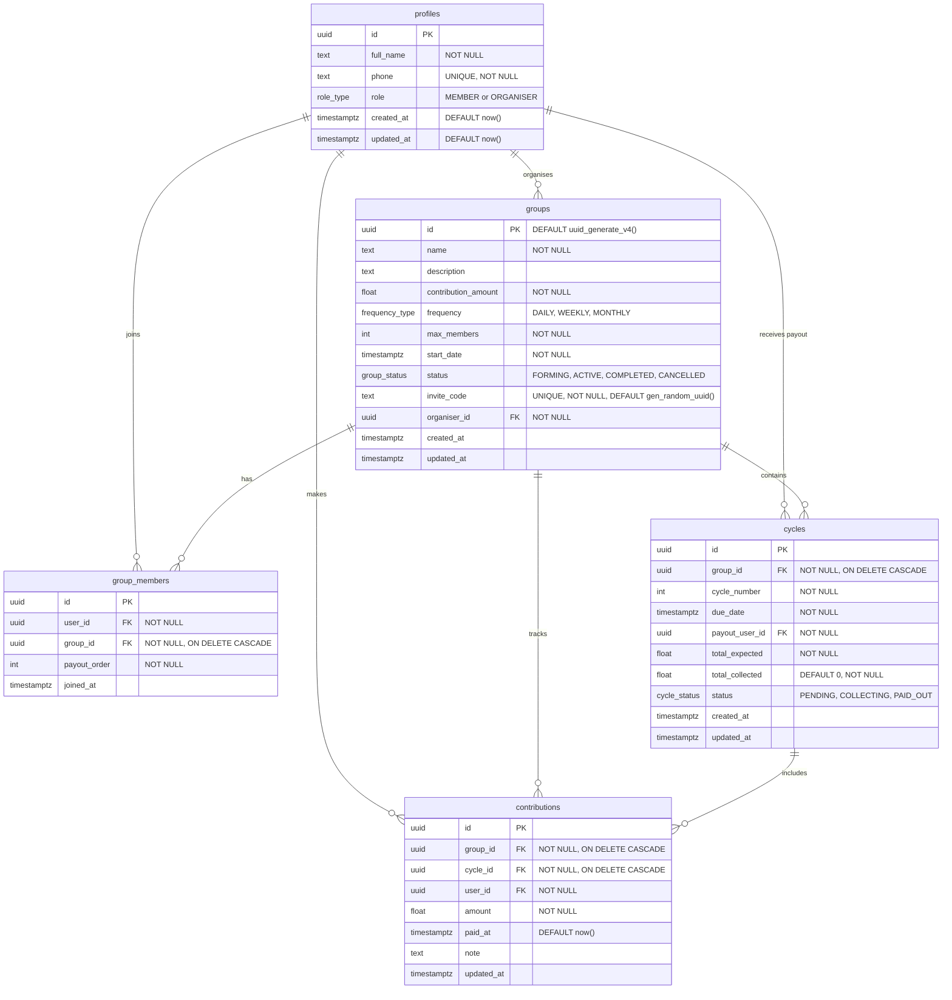
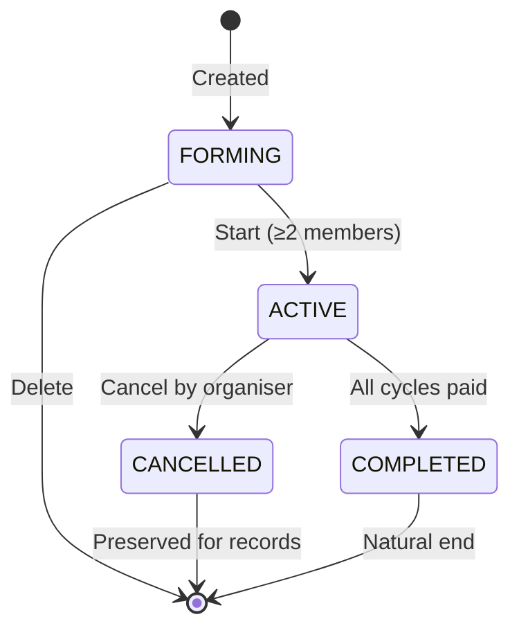
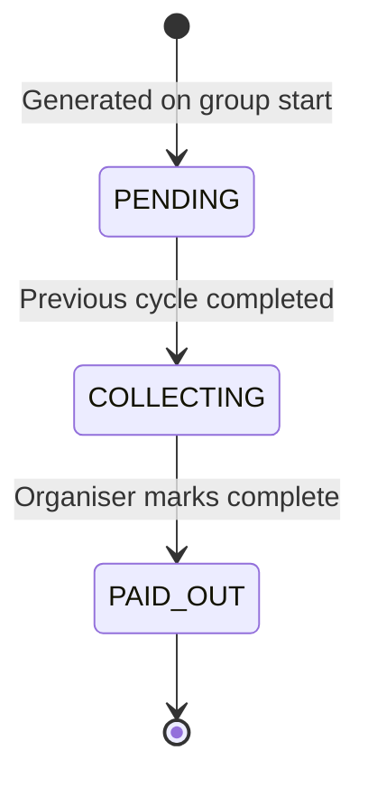
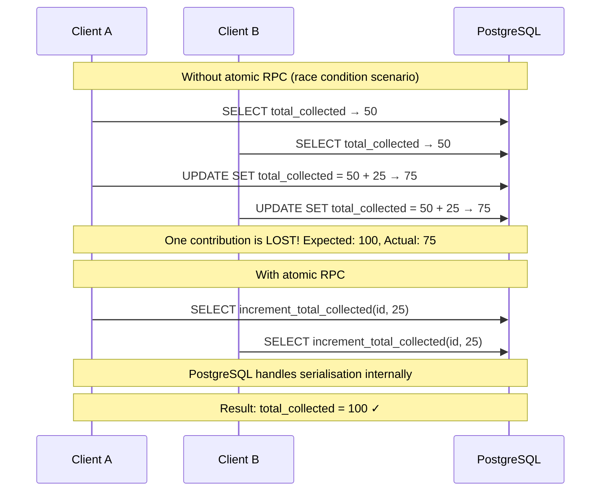

# Database Design

## Overview

Osusu uses **Supabase (PostgreSQL)** as its database. The schema is managed entirely through raw SQL files executed in the Supabase SQL Editor. There is no ORM — all database interactions use the `@supabase/supabase-js` client.

---

## Entity-Relationship Diagram



---

## Tables

### `profiles`

Extension of Supabase's `auth.users` table. Auto-created via a database trigger when a new user signs up.

| Column | Type | Constraints | Description |
|---|---|---|---|
| `id` | `uuid` | `PRIMARY KEY` — references `auth.users(id) ON DELETE CASCADE` | User UUID (matches Supabase Auth) |
| `full_name` | `text` | `NOT NULL` | User's display name |
| `phone` | `text` | `UNIQUE NOT NULL` | Gambian phone number (`+220XXXXXXX`) |
| `role` | `role_type` | `NOT NULL DEFAULT 'MEMBER'` | `MEMBER` or `ORGANISER` |
| `created_at` | `timestamptz` | `DEFAULT now()` | Account creation timestamp |
| `updated_at` | `timestamptz` | `DEFAULT now()` | Last update timestamp |

**Relationships:**
- One profile `organises` many groups (via `groups.organiser_id`)
- One profile `joins` many groups (via `group_members.user_id`)
- One profile `receives payout` for many cycles (via `cycles.payout_user_id`)
- One profile `makes` many contributions (via `contributions.user_id`)

### `groups`

The core domain entity representing a rotating savings group.

| Column | Type | Constraints | Description |
|---|---|---|---|
| `id` | `uuid` | `PRIMARY KEY DEFAULT uuid_generate_v4()` | Group UUID |
| `name` | `text` | `NOT NULL` | Group display name (3-60 chars) |
| `description` | `text` | — | Optional group description |
| `contribution_amount` | `float` | `NOT NULL` | Fixed contribution per member per cycle (min 50) |
| `frequency` | `frequency_type` | `NOT NULL` | `DAILY`, `WEEKLY`, or `MONTHLY` |
| `max_members` | `int` | `NOT NULL` | Maximum members (2-50) |
| `start_date` | `timestamptz` | `NOT NULL` | When the first cycle begins |
| `status` | `group_status` | `NOT NULL DEFAULT 'FORMING'` | `FORMING`, `ACTIVE`, `COMPLETED`, `CANCELLED` |
| `invite_code` | `text` | `UNIQUE NOT NULL DEFAULT gen_random_uuid()::text` | Random UUID code for joining |
| `organiser_id` | `uuid` | `NOT NULL` — references `profiles(id)` | Group creator and administrator |
| `created_at` | `timestamptz` | `DEFAULT now()` | Creation timestamp |
| `updated_at` | `timestamptz` | `DEFAULT now()` | Last update timestamp |

**Relationships:**
- One group `has` many members (via `group_members`)
- One group `contains` many cycles (one per member)
- One group `tracks` many contributions (via `contributions`)

### `group_members`

Many-to-many relationship linking users to groups with payout order tracking.

| Column | Type | Constraints | Description |
|---|---|---|---|
| `id` | `uuid` | `PRIMARY KEY DEFAULT uuid_generate_v4()` | Membership UUID |
| `user_id` | `uuid` | `NOT NULL` — references `profiles(id)` | Member user |
| `group_id` | `uuid` | `NOT NULL` — references `groups(id) ON DELETE CASCADE` | Group joined |
| `payout_order` | `int` | `NOT NULL` | Position in payout rotation (1-based) |
| `joined_at` | `timestamptz` | `DEFAULT now()` | When the member joined |

**Constraints:**
- `UNIQUE(user_id, group_id)` — prevents duplicate membership

### `cycles`

Individual payout cycles within a group. One cycle exists per member, ordered by the payout schedule.

| Column | Type | Constraints | Description |
|---|---|---|---|
| `id` | `uuid` | `PRIMARY KEY DEFAULT uuid_generate_v4()` | Cycle UUID |
| `group_id` | `uuid` | `NOT NULL` — references `groups(id) ON DELETE CASCADE` | Parent group |
| `cycle_number` | `int` | `NOT NULL` | Sequential number (1 to member count) |
| `due_date` | `timestamptz` | `NOT NULL` | When contributions are due for this cycle |
| `payout_user_id` | `uuid` | `NOT NULL` — references `profiles(id)` | Who receives the pot |
| `total_expected` | `float` | `NOT NULL` | `contribution_amount × member count` |
| `total_collected` | `float` | `NOT NULL DEFAULT 0` | Running total, updated atomically via RPC |
| `status` | `cycle_status` | `NOT NULL DEFAULT 'PENDING'` | `PENDING`, `COLLECTING`, `PAID_OUT` |
| `created_at` | `timestamptz` | `DEFAULT now()` | Creation timestamp |
| `updated_at` | `timestamptz` | `DEFAULT now()` | Last update timestamp (auto-updated by trigger) |

**Relationships:**
- One cycle `includes` many contributions

### `contributions`

Individual payment records linking a member to a cycle.

| Column | Type | Constraints | Description |
|---|---|---|---|
| `id` | `uuid` | `PRIMARY KEY DEFAULT uuid_generate_v4()` | Contribution UUID |
| `group_id` | `uuid` | `NOT NULL` — references `groups(id) ON DELETE CASCADE` | Parent group |
| `cycle_id` | `uuid` | `NOT NULL` — references `cycles(id) ON DELETE CASCADE` | Target cycle |
| `user_id` | `uuid` | `NOT NULL` — references `profiles(id)` | Who contributed |
| `amount` | `float` | `NOT NULL` | Contribution amount (must match group.contribution_amount) |
| `paid_at` | `timestamptz` | `DEFAULT now()` | When the payment was recorded |
| `note` | `text` | — | Optional note |
| `updated_at` | `timestamptz` | `DEFAULT now()` | Last update timestamp (auto-updated by trigger) |

**Constraints:**
- `UNIQUE(user_id, cycle_id)` — only one contribution per member per cycle

---

## Enums

| Enum | Values | Used In |
|---|---|---|
| `role_type` | `MEMBER`, `ORGANISER` | `profiles.role` |
| `frequency_type` | `DAILY`, `WEEKLY`, `MONTHLY` | `groups.frequency` |
| `group_status` | `FORMING`, `ACTIVE`, `COMPLETED`, `CANCELLED` | `groups.status` |
| `cycle_status` | `PENDING`, `COLLECTING`, `PAID_OUT` | `cycles.status` |

---

## State Machine

### Group Lifecycle



**Transition rules:**
- `FORMING → ACTIVE`: Requires ≥2 members. Generates cycles, shuffles payout order.
- `FORMING → DELETED`: Only allowed when forming. Hard delete (cascades).
- `ACTIVE → CANCELLED`: Soft delete. Status updated to `CANCELLED`, records preserved.
- `ACTIVE → COMPLETED`: Automatic when the last cycle is marked `PAID_OUT`.

### Cycle Lifecycle



**Transition rules:**
- First cycle starts as `COLLECTING` immediately on group activation
- Each subsequent cycle transitions from `PENDING` to `COLLECTING` when the previous cycle is completed
- When all cycles reach `PAID_OUT`, the parent group automatically transitions to `COMPLETED`

---

## Triggers

### `on_auth_user_created`

Fires `AFTER INSERT` on `auth.users` to automatically create a corresponding `profiles` row.

```sql
create or replace function public.handle_new_user()
returns trigger
language plpgsql
security definer set search_path = public
as $$
begin
  insert into public.profiles (id, full_name, phone)
  values (
    new.id,
    new.raw_user_meta_data ->> 'full_name',
    new.raw_user_meta_data ->> 'phone'
  );
  return new;
end;
$$;

create trigger on_auth_user_created
  after insert on auth.users
  for each row execute procedure public.handle_new_user();
```

### `set_cycles_updated_at`

Automatically updates `cycles.updated_at` on every row modification.

### `set_contributions_updated_at`

Automatically updates `contributions.updated_at` on every row modification.

Both use the shared function:

```sql
create or replace function public.set_updated_at()
returns trigger
language plpgsql
security definer set search_path = public
as $$
begin
  new.updated_at = now();
  return new;
end;
$$;
```

---

## Atomic Operations (RPCs)

The `total_collected` field on cycles must be updated atomically to prevent race conditions when multiple contributions are recorded simultaneously. PostgreSQL functions (RPCs) provide single-statement atomic updates.

### `increment_total_collected`

```sql
create or replace function public.increment_total_collected(
  cycle_id uuid,
  amount_to_add float
)
returns void
language plpgsql
security definer set search_path = public
as $$
begin
  update public.cycles
  set total_collected = total_collected + amount_to_add
  where id = cycle_id;
end;
$$;
```

Called after every contribution insert.

### `decrement_total_collected`

```sql
create or replace function public.decrement_total_collected(
  cycle_id uuid,
  amount_to_remove float
)
returns void
language plpgsql
security definer set search_path = public
as $$
begin
  update public.cycles
  set total_collected = total_collected - amount_to_remove
  where id = cycle_id;
end;
$$;
```

Called after every contribution delete (undo).

### Why RPCs Instead of Client-Side Logic?



---

## Indexes

Six indexes are created to optimise frequently executed queries:

| Index Name | Table | Columns | Type | Purpose |
|---|---|---|---|---|
| `idx_cycles_group_id` | `cycles` | `group_id` | B-tree | Fast cycle lookup by group |
| `idx_cycles_group_status` | `cycles` | `group_id, status` | Composite B-tree | Filter cycles by group + status |
| `idx_contributions_cycle_id` | `contributions` | `cycle_id` | B-tree | Fast contribution lookup by cycle |
| `idx_contributions_group_id` | `contributions` | `group_id` | B-tree | Fast contribution lookup by group |
| `idx_group_members_group_id` | `group_members` | `group_id` | B-tree | Fast member lookup by group |
| `idx_group_members_user_id` | `group_members` | `user_id` | B-tree | Fast group lookup by user |

---

## Row Level Security (RLS)

RLS is enabled on all five tables but is **bypassed by the backend** (which uses the service role key). The policies exist as defence-in-depth.

| Table | Policy | Effect |
|---|---|---|
| `profiles` | Authenticated users can read all; only owner can update | Members can see each other's names |
| `groups` | Authenticated users can read all | Members see group details |
| `group_members` | Authenticated users can read all | Members see group rosters |
| `cycles` | Authenticated users can read all | Members see payout schedules |
| `contributions` | Authenticated users can read all | Members see contribution history |

---

## Consistency Guarantees

| Mechanism | Guarantee | Implementation |
|---|---|---|
| **Atomic RPCs** | Race-condition-free counter updates | `UPDATE ... SET total_collected = total_collected + N` in a single statement |
| **Unique constraints** | No duplicate records | `UNIQUE(user_id, group_id)` on memberships, `UNIQUE(user_id, cycle_id)` on contributions |
| **Compensating transactions** | No partial updates on group start | Manual rollback of payout orders and cycles if any step fails |
| **Foreign keys** | Referential integrity | All foreign key constraints with `ON DELETE CASCADE` where appropriate |
| **Default values** | Data completeness | `DEFAULT` values for status, timestamps, and invite codes |

---

## Migration Strategy

Migrations are raw SQL files stored in `server/sql/`, executed manually in the Supabase SQL Editor:

| File | Purpose | Idempotent |
|---|---|---|
| `schema.sql` | Full initial schema for new projects | Uses `IF NOT EXISTS` |
| `001_add_daily_frequency.sql` | Add `DAILY` to `frequency_type` enum | Yes |
| `002_add_cancelled_status.sql` | Add `CANCELLED` to `group_status` enum | Yes |
| `003_atomic_total_collected.sql` | RPCs, triggers, indexes | Uses `CREATE OR REPLACE`, `IF NOT EXISTS` |

**For new projects:** Run `schema.sql` only.
**For existing projects:** Run migrations sequentially (001, 002, 003) in the Supabase SQL Editor.
