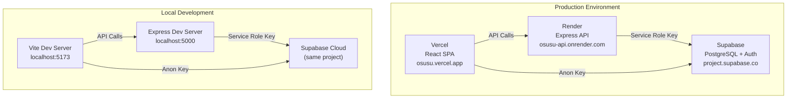

# Deployment Guide

## Overview

Osusu is designed for deployment on **Render** (backend) and **Vercel** (frontend) with **Supabase** as the managed database. This guide covers both local development setup and production deployment.

---

## Architecture Overview



---

## Prerequisites

- **Node.js 20+**
- **npm**
- **Git**
- **Supabase account** (free tier)
- **Render account** (free tier)
- **Vercel account** (free tier)
- **GitHub account** (for repository hosting)

---

## 1. Database Setup (Supabase)

### Create a Supabase Project

1. Go to [supabase.com](https://supabase.com) and sign up/in
2. Click **New project**
3. Enter project name (e.g., `osusu`)
4. Set a secure database password
5. Choose a region close to your target users (West Africa / Europe)
6. Click **Create new project** (takes 1-2 minutes)

### Configure the Schema

1. In the Supabase dashboard, go to **SQL Editor**
2. Click **New query**
3. Open `server/sql/schema.sql` from the project
4. Copy and paste the entire contents
5. Click **Run** (or `Ctrl + Enter`)

### Get API Credentials

1. Go to **Project Settings → API**
2. Note down:
   - **Project URL** → `SUPABASE_URL`
   - **anon public key** → `VITE_SUPABASE_ANON_KEY` and `SUPABASE_ANON_KEY`
   - **service_role key** → `SUPABASE_SERVICE_ROLE_KEY`

### Configure Auth Settings

1. Go to **Authentication → Settings**
2. Under **Email Auth**, ensure email/password sign-up is enabled
3. (Optional) Disable "Confirm email" for development — for production, keep it enabled

---

## 2. Backend Deployment (Render)

### Prepare the Repository

Ensure your code is pushed to a GitHub repository with the following structure:

```
your-repo/
├── client/           # Frontend
├── server/           # Backend
├── README.md
└── .gitignore        # Must include .env, .env.local, node_modules
```

### Deploy to Render

1. Go to [render.com](https://render.com) and sign up/in
2. Click **New +** → **Web Service**
3. Connect your GitHub repository
4. Configure the service:

| Setting | Value |
|---|---|
| **Name** | `osusu-api` |
| **Root Directory** | `server` |
| **Runtime** | Node |
| **Build Command** | `npm install` |
| **Start Command** | `node server.js` |
| **Plan** | Free |

5. Add environment variables:

| Variable | Value |
|---|---|
| `PORT` | `5000` |
| `SUPABASE_URL` | Your Supabase project URL |
| `SUPABASE_SERVICE_ROLE_KEY` | Your service role key |
| `CLIENT_URL` | Will be your Vercel URL (set after frontend deploy) |

6. Click **Create Web Service**
7. Wait for the build to complete
8. Note the deployed URL (e.g., `https://osusu-api.onrender.com`)

### Verify Backend

```bash
curl https://osusu-api.onrender.com/api/health
# Expected: {"status":"ok","timestamp":"..."}
```

---

## 3. Frontend Deployment (Vercel)

### Prepare Environment Variables

Create `client/.env.production` with production values:

```env
VITE_SUPABASE_URL=https://your-project.supabase.co
VITE_SUPABASE_ANON_KEY=your-anon-key
VITE_API_URL=https://osusu-api.onrender.com/api
```

### Deploy to Vercel

1. Go to [vercel.com](https://vercel.com) and sign up/in
2. Click **Add New → Project**
3. Import your GitHub repository
4. Configure the project:

| Setting | Value |
|---|---|
| **Root Directory** | `client` |
| **Framework Preset** | Vite |
| **Build Command** | `npm run build` |
| **Output Directory** | `dist` |

5. Add environment variables:

| Variable | Value |
|---|---|
| `VITE_SUPABASE_URL` | Your Supabase project URL |
| `VITE_SUPABASE_ANON_KEY` | Your anon key |
| `VITE_API_URL` | `https://osusu-api.onrender.com/api` |

6. Click **Deploy**
7. Wait for the build to complete
8. Note the deployed URL (e.g., `https://osusu.vercel.app`)

### Update Backend CORS

1. Go back to **Render Dashboard → osusu-api → Environment**
2. Update `CLIENT_URL` to your Vercel URL:
   ```
   CLIENT_URL=https://osusu.vercel.app
   ```
3. Click **Save Changes** → **Manual Deploy** → **Deploy latest commit**

---

## 4. Post-Deployment Verification

### Automated Smoke Test

```bash
# 1. Health check
curl https://osusu-api.onrender.com/api/health

# 2. Register a test user
curl -X POST https://osusu-api.onrender.com/api/auth/register \
  -H "Content-Type: application/json" \
  -d '{"fullName":"Test User","email":"test@example.com","phone":"+2201234567","password":"test1234"}'

# 3. Login
curl -X POST https://osusu-api.onrender.com/api/auth/login \
  -H "Content-Type: application/json" \
  -d '{"email":"test@example.com","password":"test1234"}'
```

### Manual Verification Checklist

- [ ] Open the Vercel URL in a browser
- [ ] Register a new account → redirected to dashboard
- [ ] Create a group → invite code displayed
- [ ] Log out, register a second account
- [ ] Join the group with the invite code
- [ ] Start the group → schedule appears
- [ ] Record a contribution → progress updates
- [ ] Test on a mobile phone → responsive layout
- [ ] No CORS errors in browser console
- [ ] No console errors on any page

---

## 5. Production Considerations

### Database

| Consideration | Recommendation |
|---|---|
| **Backups** | Enable Supabase Point-in-Time Recovery in project settings |
| **Connection pooling** | Supabase handles this automatically with PgBouncer |
| **Read replicas** | Not needed at MVP scale |
| **Query performance** | Monitor with Supabase Query Performance dashboard |

### Backend (Render)

| Consideration | Recommendation |
|---|---|
| **Scaling** | Render free tier sleeps after inactivity. Upgrade to paid for always-on |
| **Memory** | Monitor in Render dashboard. Current usage is < 200MB |
| **Logging** | Available in Render dashboard log stream |
| **Custom domain** | Configure in Render settings (or use Cloudflare DNS) |
| **Environment variables** | All stored in Render dashboard, never in code |

### Frontend (Vercel)

| Consideration | Recommendation |
|---|---|
| **Edge Network** | Vercel serves from global CDN automatically |
| **Analytics** | Enable Vercel Analytics for usage insights |
| **Custom domain** | Add in Vercel → Project → Domains |
| **Preview deployments** | Enabled by default for every PR/branch |
| **Environment variables** | Set in Vercel dashboard, never in committed files |

---

## 6. Environment Configuration Reference

### Server (`server/.env`) — Local Development

```env
PORT=5000
SUPABASE_URL=https://your-project.supabase.co
SUPABASE_SERVICE_ROLE_KEY=eyJ... (service_role key)
CLIENT_URL=http://localhost:5173
```

### Server (Render) — Production

Configured in **Render Dashboard → Environment** (never committed):

| Variable | Production Value |
|---|---|
| `PORT` | `5000` |
| `SUPABASE_URL` | Same as local |
| `SUPABASE_SERVICE_ROLE_KEY` | Same as local |
| `CLIENT_URL` | `https://your-app.vercel.app` |

### Client (`client/.env.local`) — Local Development

```env
VITE_SUPABASE_URL=https://your-project.supabase.co
VITE_SUPABASE_ANON_KEY=eyJ... (anon key)
VITE_API_URL=http://localhost:5000/api
```

### Client (Vercel) — Production

Configured in **Vercel Dashboard → Project → Environment Variables**:

| Variable | Production Value |
|---|---|
| `VITE_SUPABASE_URL` | Same as local |
| `VITE_SUPABASE_ANON_KEY` | Same as local |
| `VITE_API_URL` | `https://your-api.onrender.com/api` |

---

## 7. Common Deployment Issues

| Issue | Cause | Solution |
|---|---|---|
| CORS errors | `CLIENT_URL` mismatch | Verify `CLIENT_URL` matches exactly the deployed frontend URL (no trailing slash) |
| Blank page on Vercel | Build errors or environment variables | Check Vercel build logs; verify `VITE_API_URL` is correct |
| Auth token errors | Service role key mismatch | Verify `SUPABASE_SERVICE_ROLE_KEY` is correct in Render environment |
| 500 errors on API | Missing environment variables | Check all `process.env.VAR` references correspond to Render environment variables |
| Database errors | Schema not applied | Run `schema.sql` in Supabase SQL Editor; verify all tables exist |
| Stale data | No migration files run | Run migration files 001-003 in order in Supabase SQL Editor |
