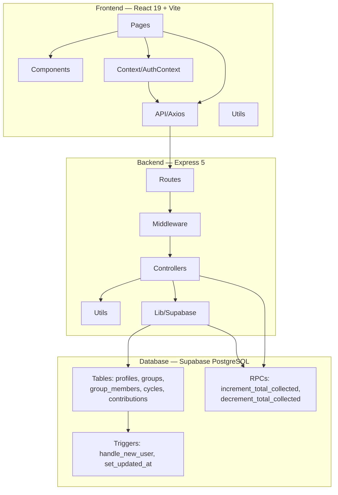
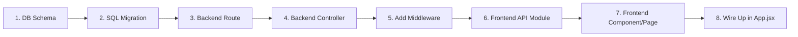

# Developer Guide

## Overview

This guide provides practical instructions for developers working on the Osusu codebase, including development environment setup, coding conventions, database management, and troubleshooting common issues.

---

## Development Environment Setup

### Prerequisites

```bash
# Verify versions
node --version   # Must be 20+
npm --version    # Comes with Node
git --version    # Any recent version
```

### Initial Setup

```bash
# Clone the repository
git clone <repo-url>
cd osusu

# Install backend dependencies
cd server
npm install

# Install frontend dependencies
cd ../client
npm install

# Create environment files
cp .env.example .env        # Server (create from template)
touch .env.local             # Client (create empty, add values)
```

### Supabase Setup

1. Create a free project at [supabase.com](https://supabase.com)
2. Run `server/sql/schema.sql` in the Supabase SQL Editor
3. Get credentials from **Project Settings → API**
4. Add to environment files:

**`server/.env`:**
```env
PORT=5000
SUPABASE_URL=https://your-project.supabase.co
SUPABASE_SERVICE_ROLE_KEY=eyJ... (service_role key)
CLIENT_URL=http://localhost:5173
```

**`client/.env.local`:**
```env
VITE_SUPABASE_URL=https://your-project.supabase.co
VITE_SUPABASE_ANON_KEY=eyJ... (anon key)
VITE_API_URL=http://localhost:5000/api
```

### Running the Application

```bash
# Terminal 1 — Backend (port 5000)
cd server
npm run dev

# Terminal 2 — Frontend (port 5173)
cd client
npm run dev
```

Open **http://localhost:5173** in your browser.

---

## Project Architecture Quick Reference



---

## Coding Conventions

### General

- **JavaScript** — Modern ES6+ syntax (arrow functions, destructuring, template literals, async/await)
- **No TypeScript** — The project uses plain JavaScript (JSX for React)
- **CommonJS** — Backend uses `require()` / `module.exports`
- **ES Modules** — Frontend uses `import` / `export` (via Vite)

### Backend Conventions

| Convention | Standard |
|---|---|
| File naming | `kebab-case.js` (e.g., `auth.controller.js`, `requireOrganiser.js`) |
| Function naming | `camelCase` (e.g., `authenticateToken`, `createGroup`) |
| Variable naming | `camelCase` |
| Database columns | `snake_case` (e.g., `payout_order`, `organiser_id`) |
| API response fields | `camelCase` (e.g., `payoutOrder`, `organiserId`) |
| Error responses | `{ success: false, error: { message } }` |
| Success responses | `{ success: true, data: { ... } }` |
| Route filenames | `kebab-case.routes.js` |
| Controller filenames | `kebab-case.controller.js` |

### Frontend Conventions

| Convention | Standard |
|---|---|
| File naming | `PascalCase.jsx` for components (e.g., `Button.jsx`, `DashboardPage.jsx`) |
| Component naming | `PascalCase` (e.g., `function Button()`) |
| Custom hook naming | `camelCase` with `use` prefix (e.g., `useAuth`) |
| CSS | Tailwind utility classes (avoid custom CSS when possible) |
| State variables | `camelCase` with descriptive names (e.g., `isLoading`, `groupData`) |
| Prop naming | `camelCase` (e.g., `variant`, `isOpen`, `onClose`) |

### Database Conventions

| Convention | Standard |
|---|---|
| Table names | `snake_case`, plural (e.g., `group_members`, `cycles`) |
| Column names | `snake_case` (e.g., `payout_order`, `start_date`) |
| Primary keys | Always `id` of type `uuid` |
| Foreign keys | References table name (e.g., `group_id`, `user_id`) |
| Timestamps | `created_at`, `updated_at` (auto-managed by triggers) |

---

## Adding a New Feature

### Step-by-Step Process



### Example: Adding a Group Notes Feature

**1. Database Migration** (`server/sql/004_add_group_notes.sql`):

```sql
ALTER TABLE public.groups ADD COLUMN notes text;
```

**2. Update Controller** (`server/src/controllers/groups.controller.js`):

```js
// In updateGroup (or createGroup):
const { notes } = req.body;

const { data, error } = await supabaseAdmin
  .from('groups')
  .update({ notes })
  .eq('id', groupId)
  .select()
  .single();
```

**3. Add API Call** (`client/src/api/groups.js`):

```js
export const updateGroupNotes = (groupId, notes) =>
  api.put(`/groups/${groupId}/notes`, { notes });
```

**4. Update Frontend** (GroupDetailPage.jsx):

```jsx
const [notes, setNotes] = useState(group.notes || '');
const [saving, setSaving] = useState(false);

const handleSave = async () => {
  setSaving(true);
  try {
    await updateGroupNotes(groupId, notes);
    toast.success('Notes saved');
  } catch {
    toast.error('Failed to save notes');
  } finally {
    setSaving(false);
  }
};
```

---

## Database Management

### Schema Files

All schema SQL is in `server/sql/`:

| File | When to Use |
|---|---|
| `schema.sql` | New project — run entire file |
| `001_add_daily_frequency.sql` | Add `DAILY` to frequency enum |
| `002_add_cancelled_status.sql` | Add `CANCELLED` status |
| `003_atomic_total_collected.sql` | Atomic RPCs + indexes |

### Creating a Migration

1. Create a new file: `server/sql/004_your_migration.sql`
2. Use `IF NOT EXISTS` / `CREATE OR REPLACE` for idempotency
3. Run in Supabase SQL Editor
4. Document the migration in this guide

### Common Database Operations

```js
// SELECT one row
const { data, error } = await supabaseAdmin
  .from('groups')
  .select('*')
  .eq('id', groupId)
  .single();

// SELECT with join
const { data, error } = await supabaseAdmin
  .from('group_members')
  .select('*, profiles(id, full_name, email)')
  .eq('group_id', groupId);

// INSERT
const { data, error } = await supabaseAdmin
  .from('groups')
  .insert({ name, description, contribution_amount, ... })
  .select()
  .single();

// INSERT batch
const { error } = await supabaseAdmin
  .from('cycles')
  .insert(cyclesArray);

// UPDATE
const { data, error } = await supabaseAdmin
  .from('groups')
  .update({ status: 'ACTIVE' })
  .eq('id', groupId)
  .select()
  .single();

// DELETE
const { error } = await supabaseAdmin
  .from('contributions')
  .delete()
  .eq('id', contributionId);

// Call RPC
const { error } = await supabaseAdmin.rpc('increment_total_collected', {
  cycle_id: cycleId,
  amount_to_add: amount,
});
```

### Error Code Reference

| Code | Meaning | Handling |
|---|---|---|
| `PGRST116` | No rows found (`single()` returned null) | Return 404 |
| `23505` | Unique constraint violation (duplicate) | Return 409 |
| `23503` | Foreign key violation | Return 400 with context |
| `42P01` | Table does not exist | Check schema was run |

---

## Environment Variables

### Server (`server/.env`)

```env
# Required
PORT=5000
SUPABASE_URL=https://your-project.supabase.co
SUPABASE_SERVICE_ROLE_KEY=eyJ...

# Required for CORS
CLIENT_URL=http://localhost:5173
```

### Client (`client/.env.local`)

```env
# Required
VITE_SUPABASE_URL=https://your-project.supabase.co
VITE_SUPABASE_ANON_KEY=eyJ...
VITE_API_URL=http://localhost:5000/api
```

---

## Debugging Tips

### Backend

| Problem | Debug Command |
|---|---|
| View request logs | Check terminal running `npm run dev` (morgan logs) |
| Test an endpoint | `curl -X GET http://localhost:5000/api/health` |
| Check database connection | Verify `SUPABASE_URL` and key in `.env` |
| Inspect Supabase queries | Supabase Dashboard → Database → Query Performance |

### Frontend

| Problem | Tool |
|---|---|
| Network requests | Browser DevTools → Network tab |
| Auth state | Browser DevTools → Application → Local Storage → `sb-*-auth-token` |
| Component state | React DevTools browser extension |
| Console errors | Browser DevTools → Console |
| Build issues | `npm run build` and check terminal output |

### Common Issues

#### "Cannot find module 'express'"

```bash
cd server && npm install
```

#### "Module not found" for frontend paths

Ensure the import path is correct. Frontend uses ES modules:
```js
// Correct
import api from '../api/axios';

// Wrong
import api from '../api/axios.js';  // .js extension not needed with Vite
```

#### "Port 5000 already in use"

```bash
# Find the process
lsof -i :5000

# Kill it
kill -9 <PID>

# Or use a different port
PORT=5001 npm run dev
```

#### "CORS error" in browser

Check `CLIENT_URL` in `server/.env` matches your frontend URL exactly:

```env
# If frontend is on port 5173:
CLIENT_URL=http://localhost:5173
# If frontend is on port 3000:
CLIENT_URL=http://localhost:3000
```

#### Supabase "Invalid API key"

```bash
# Verify the keys match what's in Supabase Dashboard
# Project Settings → API → Project API keys
echo $SUPABASE_SERVICE_ROLE_KEY
echo $SUPABASE_ANON_KEY
```

---

## Git Workflow

### Branch Strategy

```
main          — Production-ready code
  └─ feature/ — New features (e.g., feature/group-notes)
  └─ fix/     — Bug fixes (e.g., fix/login-error)
  └─ docs/    — Documentation updates
```

### Commit Messages

Follow conventional commits:

```
feat: add group notes feature
fix: handle empty invite code error
docs: update API reference
chore: update dependencies
refactor: extract payment validation logic
```

### Before Committing

```bash
# Check what changed
git status
git diff

# Stage specific files (never use git add . without review)
git add server/src/controllers/groups.controller.js
git add client/src/pages/GroupDetailPage.jsx

# Commit with descriptive message
git commit -m "feat: add group notes feature"
```

---

## Performance Checklist

Before submitting a PR, verify:

- [ ] Database queries have appropriate indexes
- [ ] No N+1 query patterns (multiple sequential single-row queries)
- [ ] API responses return only necessary fields
- [ ] Frontend uses `cancelled` flag in `useEffect` cleanup
- [ ] Forms validate before submitting
- [ ] Loading states shown during async operations
- [ ] Error states handle network failures gracefully
- [ ] No console.log statements in production code
