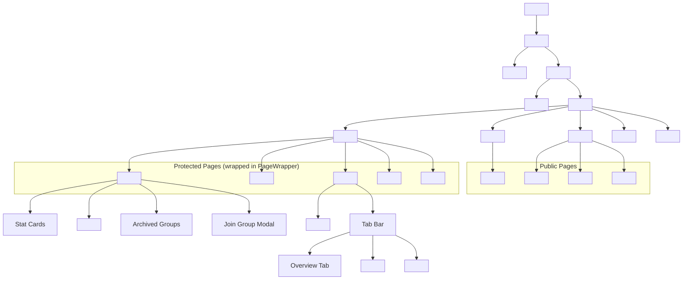
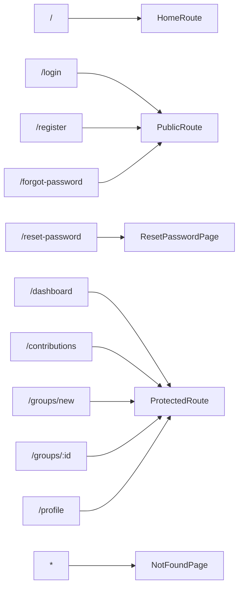
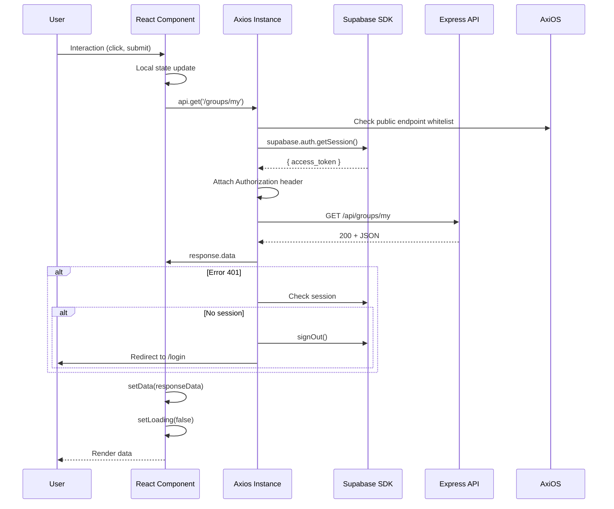

# Frontend Architecture

## Overview

The Osusu frontend is a **React 19 single-page application** built with **Vite 8** and styled with **Tailwind CSS 3**. It follows a component-based architecture with React Context for global state management and Axios interceptors for API communication.

---

## Technology Choices

| Technology | Version | Purpose | Rationale |
|---|---|---|---|
| **React** | 19 | UI framework | Component-based, declarative, mature ecosystem |
| **Vite** | 8 | Build tool | Fast HMR, optimised builds, native ESM |
| **Tailwind CSS** | 3 | Styling | Utility-first, consistent design, small bundles |
| **React Router** | 7 | Client-side routing | Declarative route definitions, guard patterns |
| **Axios** | 1 | HTTP client | Interceptor architecture, clean API |
| **Supabase JS** | 2 | Auth SDK | Session management, token handling |
| **react-hot-toast** | 2 | Notifications | Lightweight, minimal API |

---

## Application Structure

```
client/src/
├── api/                     # API abstraction layer
│   ├── axios.js             # Axios instance with auth interceptors
│   └── groups.js            # Group-specific API helpers
├── components/
│   ├── common/              # Reusable UI primitives
│   │   ├── BackButton.jsx
│   │   ├── Badge.jsx
│   │   ├── Breadcrumb.jsx
│   │   ├── Button.jsx
│   │   ├── EmptyState.jsx
│   │   ├── Input.jsx
│   │   ├── LoadingSpinner.jsx
│   │   ├── Modal.jsx
│   │   ├── Spinner.jsx
│   │   └── TopProgressBar.jsx
│   ├── groups/              # Domain-specific group components
│   │   ├── ContributionsTab.jsx
│   │   ├── GroupCard.jsx
│   │   └── ScheduleTab.jsx
│   └── layout/              # Layout components
│       ├── Footer.jsx
│       ├── Navbar.jsx
│       └── PageWrapper.jsx
├── context/
│   └── AuthContext.jsx      # Global authentication state
├── lib/
│   └── supabase.js          # Supabase browser client
├── pages/                   # Route-level page components
│   ├── LandingPage.jsx
│   ├── LoginPage.jsx
│   ├── RegisterPage.jsx
│   ├── ForgotPasswordPage.jsx
│   ├── ResetPasswordPage.jsx
│   ├── DashboardPage.jsx
│   ├── CreateGroupPage.jsx
│   ├── GroupDetailPage.jsx
│   ├── MyContributionsPage.jsx
│   ├── ProfilePage.jsx
│   └── NotFoundPage.jsx
├── utils/
│   └── helpers.js           # Currency and date formatting
├── App.jsx                  # Router setup with route guards
├── App.css                  # Legacy (unused)
├── index.css                # Tailwind directives + custom utilities
└── main.jsx                 # Application entry point
```

---

## Component Hierarchy



---

## Component Architecture

### Common Components

| Component | Props | Description | States |
|---|---|---|---|
| **Button** | `variant`, `size`, `loading`, `disabled`, `onClick`, `children`, `type`, `className` | Styled button with loading spinner | default, hover, active, disabled, loading |
| **Input** | `label`, `name`, `type`, `placeholder`, `error`, `value`, `onChange`, `disabled`, `ref` (forwardRef) | Labelled form input | default, focus, error, disabled |
| **Modal** | `isOpen`, `onClose`, `title`, `children` | Full-screen backdrop modal | closed, open (with animation) |
| **Badge** | `status` | Small coloured status indicator | FORMING(gray), ACTIVE(green), COMPLETED(blue), CANCELLED(red), COLLECTING(amber) |
| **Spinner** | `fullPage` | Loading overlay with branding | visible |
| **LoadingSpinner** | `fullPage`, `size` | Inline SVG spinner | visible |
| **EmptyState** | `title`, `description`, `action`, `icon` | Empty list placeholder | visible |
| **Breadcrumb** | `items` (array of `{ label, href? }`) | Navigation breadcrumb | visible |
| **BackButton** | `to`, `fallback`, `label` | Smart navigation back | visible |
| **TopProgressBar** | — | Route change progress indicator | animating, hidden |

### Group Components

| Component | Props | Description |
|---|---|---|
| **GroupCard** | `group`, `isOrganiser` | Dashboard card showing group details, status, and payout position |
| **ContributionsTab** | `groupId`, `group`, `members`, `isOrganiser` | Cycle selector, progress indicator, member payment list |
| **ScheduleTab** | `groupId` | Full payout schedule table with dates, recipients, and status |

### Layout Components

| Component | Description |
|---|---|
| **Navbar** | Sticky responsive nav with scroll-blur, mobile slide-out drawer, auth-aware links |
| **Footer** | Dark footer with branding, links, and tagline |
| **PageWrapper** | Wraps protected pages with Navbar + content + Footer |

---

## State Management

### Global State — AuthContext

React Context provides global authentication state without external libraries:

```jsx
// AuthContext provides:
const { user, loading, setLoggedInUser, logout, refreshUser } = useAuth();

// State:
user  → object | null  (the authenticated user profile)
loading → boolean      (true while initial session check runs)

// Methods:
setLoggedInUser(userData)  → called after login/register
logout()                   → clears auth state and Supabase session
refreshUser()              → re-fetches profile from /auth/me
```

**Initialisation flow:**
1. On mount, call `supabase.auth.getSession()`
2. If session exists, fetch profile via `GET /api/auth/me`
3. Subscribe to `onAuthStateChange` for reactive updates

### Local State Pattern

Every data-fetching page follows a consistent pattern:

```jsx
const [data, setData] = useState(null);
const [loading, setLoading] = useState(true);
const [error, setError] = useState(null);

useEffect(() => {
  let cancelled = false;
  const load = async () => {
    try {
      const res = await api.get('/endpoint');
      if (!cancelled) setData(res.data.data);
    } catch (err) {
      if (!cancelled) setError(err.response?.data?.error?.message || 'Something went wrong');
    } finally {
      if (!cancelled) setLoading(false);
    }
  };
  load();
  return () => { cancelled = true; };
}, []);
```

**Cancelled flag pattern:** Prevents state updates on unmounted components — a best practice for React 18+.

---

## Routing Architecture

### Route Definitions (`App.jsx`)



### Route Guards

| Guard | Loading State | Authenticated | Unauthenticated | Used By |
|---|---|---|---|---|
| **ProtectedRoute** | Show `<Spinner fullPage />` | Render children | Redirect to `/login` | Dashboard, CreateGroup, GroupDetail, Profile, MyContributions |
| **PublicRoute** | Show `<Spinner fullPage />` | Redirect to `/dashboard` | Render children | Login, Register, ForgotPassword |
| **HomeRoute** | Show `<LoadingSpinner fullPage />` | Redirect to `/dashboard` | Render `<LandingPage />` | `/` (root) |

---

## API Abstraction Layer

### Axios Instance (`src/api/axios.js`)

```jsx
import axios from 'axios';
import { supabase } from '../lib/supabase';

const api = axios.create({
  baseURL: import.meta.env.VITE_API_URL || 'http://localhost:5000/api',
});

// Public endpoint whitelist
const publicEndpoints = [
  '/auth/login',
  '/auth/register',
  '/auth/forgot-password',
  '/auth/reset-password',
];

// Request interceptor — attach Bearer token
api.interceptors.request.use(async (config) => {
  if (!publicEndpoints.some(path => config.url.includes(path))) {
    const { data: { session } } = await supabase.auth.getSession();
    if (session?.access_token) {
      config.headers.Authorization = `Bearer ${session.access_token}`;
    }
  }
  return config;
});

// Response interceptor — handle 401 globally
api.interceptors.response.use(
  (res) => res,
  async (err) => {
    if (err.response?.status === 401) {
      const { data: { session } } = await supabase.auth.getSession();
      if (!session) {
        await supabase.auth.signOut();
        window.location.href = '/login?reason=session_expired';
      }
    }
    return Promise.reject(err);
  }
);

export default api;
```

**Key design decisions:**
- Public endpoints whitelist avoids unnecessary `getSession()` calls
- Async interceptor awaits session resolution before each request
- 401 handler distinguishes between expired tokens and missing sessions
- Redirect preserves reason in query parameter for user feedback

---

## Data Flow



---

## Styling Architecture

### Tailwind Configuration

Custom design tokens in `tailwind.config.js`:

```js
module.exports = {
  content: ['./index.html', './src/**/*.{js,jsx}'],
  theme: {
    extend: {
      colors: {
        brand: { 50: '#eef2ff', ..., 700: '#4338ca' },
        accent: { 50: '#fff1f2', ..., 700: '#be123c' },
      },
      fontFamily: { sans: ['Inter', ...defaultTheme.fontFamily.sans] },
      boxShadow: {
        soft: '0 2px 15px -3px rgba(0,0,0,0.07)',
        glow: '0 0 15px rgba(34,197,94,0.4)',
      },
      animation: {
        'modal-in': 'modalIn 0.2s ease-out',
        'slide-up': 'slideUp 0.3s ease-out',
        'fade-in': 'fadeIn 0.3s ease-out',
      },
    },
  },
};
```

### Custom CSS (`index.css`)

```css
@tailwind base;
@tailwind components;
@tailwind utilities;

@import url('https://fonts.googleapis.com/css2?family=Inter:wght@400;500;600;700&display=swap');

body {
  @apply antialiased text-gray-800 bg-slate-50 font-sans;
}

@layer utilities {
  .glass-card {
    @apply bg-white/80 backdrop-blur-sm border border-white/20 shadow-soft;
  }
  .scrollbar-hide {
    -ms-overflow-style: none;
    scrollbar-width: none;
  }
  .page-enter {
    animation: fadeInUp 0.3s ease-out;
  }
}
```

### Responsive Design Strategy

| Breakpoint | Width | Behaviour |
|---|---|---|
| Default | < 640px | Single column, bottom-sheet modals, hamburger nav |
| `sm:` | 640px+ | Two-column grids |
| `md:` | 768px+ | Side-by-side layouts, centered modals |
| `lg:` | 1024px+ | Multi-column grids, max-width container |

---

## Key Patterns

### Multi-Step Form Wizard (`CreateGroupPage`)

The 3-step group creation flow uses a visual progress stepper:

```
Step 1: Basics        → Step 2: Rules    → Step 3: Review    → Success!
   [Name, Amount]        [Frequency,         [Summary]           [Invite Code]
    Max Members]          Start Date]
```

State is managed locally with `currentStep` (1-4, where 4 is success). Each step validates before advancing.

### Tab-Based Navigation (`GroupDetailPage`)

A single page with tab state (`activeTab`) toggling between Overview, Contributions, and Schedule views. This avoids separate sub-routes while keeping group context centralized.

### Clipboard API with Fallback

```js
const handleCopy = async () => {
  try {
    await navigator.clipboard.writeText(code);
    toast.success('Copied!');
  } catch {
    // Fallback for older browsers
    const textarea = document.createElement('textarea');
    textarea.value = code;
    document.body.appendChild(textarea);
    textarea.select();
    document.execCommand('copy');
    document.body.removeChild(textarea);
    toast.success('Copied!');
  }
};
```

### Password Strength Meter

Real-time visual feedback (0-5 scale) based on:
- Length ≥ 8 characters
- Contains uppercase letter
- Contains lowercase letter
- Contains digit
- Contains special character

---

## Error Handling

### Page-Level Loading/Error States

Every page handles three states:

| State | Visual | Implementation |
|---|---|---|
| **Loading** | `<Spinner fullPage />` or `<LoadingSpinner />` | `loading` state before API resolves |
| **Error** | Alert banner with message | `error` state on API failure |
| **Empty** | `<EmptyState />` with optional action | Empty data array after successful fetch |
| **Success** | Normal rendered content | Data populated and ready |

### Toast Notifications

- Success: "Group created successfully", "Contribution recorded"
- Error: "Failed to create group", "Invalid invite code"
- Info: "Copied to clipboard"

---

## Performance Optimisations

- **Cancelled flag pattern** — Prevents state updates on unmounted components
- **Conditional rendering** — Tabs and modals render only when active
- **Early returns** — Loading/error states return before main render logic
- **Optimised imports** — Only imported components are bundled
- **Tailwind purging** — Only used utility classes in production bundle
