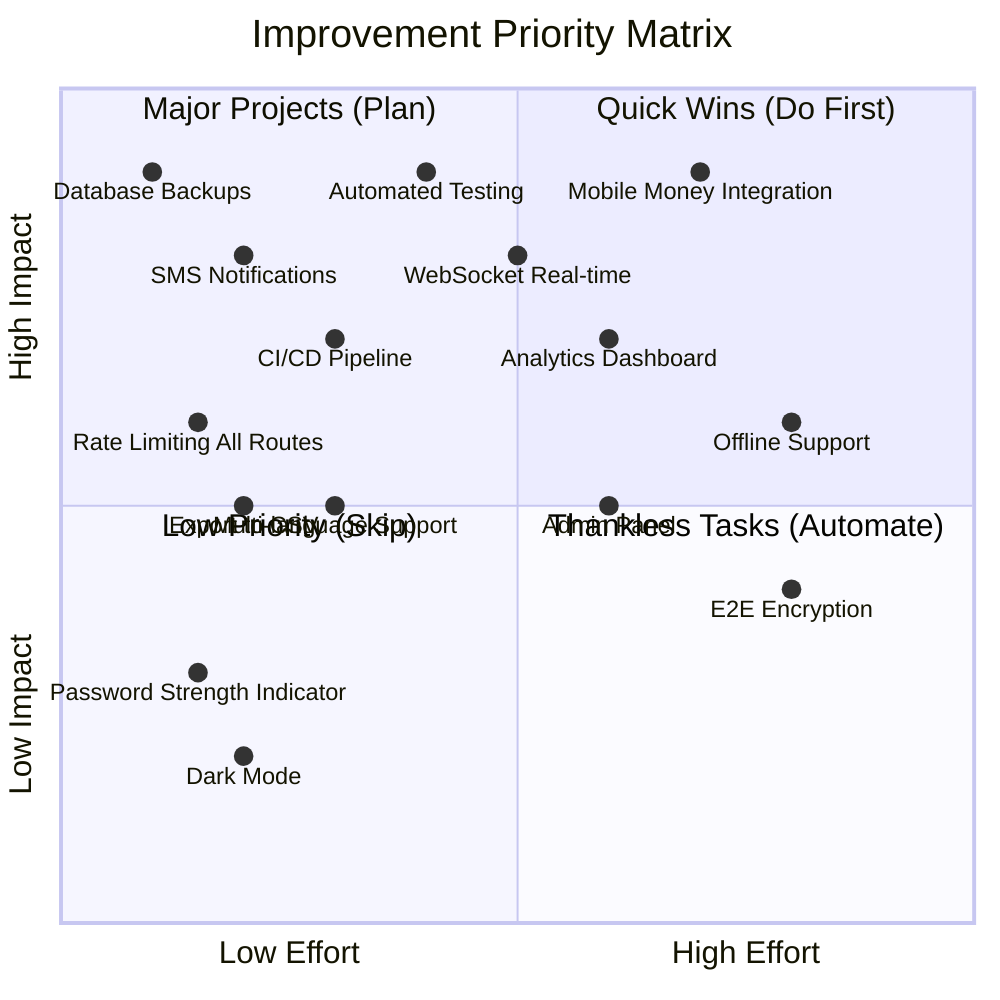
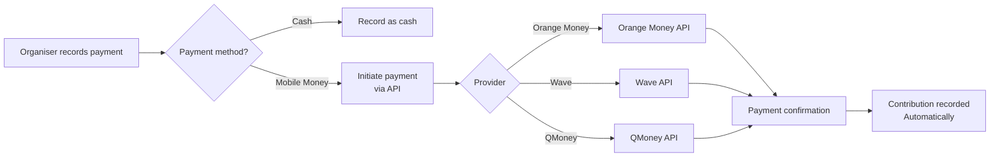
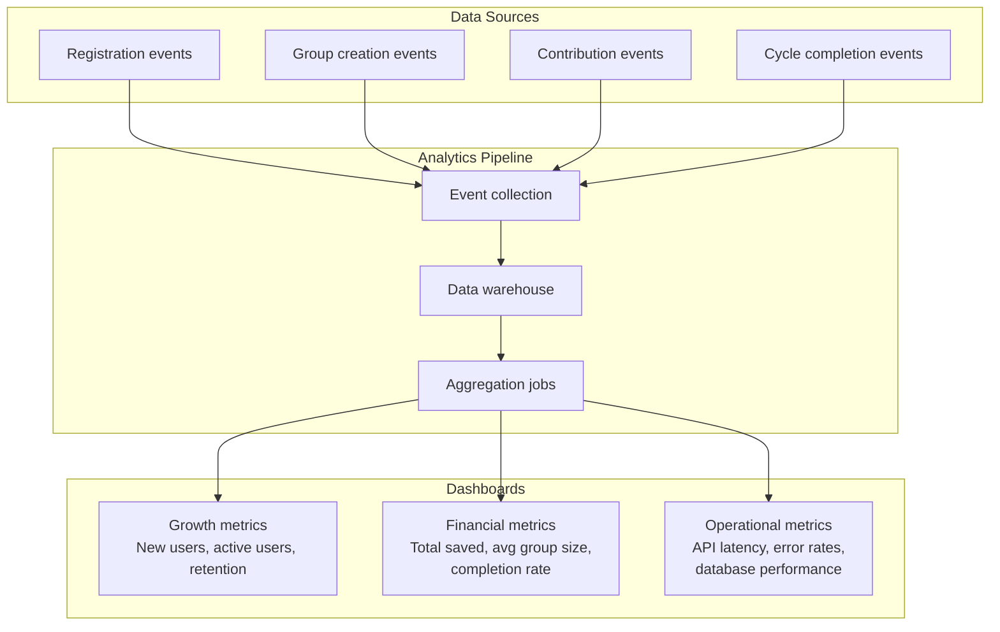
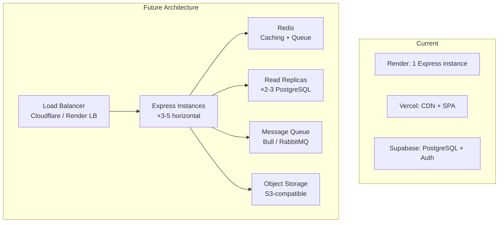

# Future Improvements

## Overview

This document outlines a strategic roadmap for evolving the Osusu platform from an MVP into a production-grade financial technology platform. Improvements are categorised by priority and impact.

---

## Priority Matrix



---

## Phase 1: Foundation Improvements (Current - 3 Months)

### 1.1 Automated Testing

**Why:** The project currently has zero automated tests. This is the single most important improvement for reliability.

**What:**
- Unit tests for all utility functions (shuffle, payout schedule, helpers)
- Controller unit tests with mocked database
- API integration tests with a test database
- Component tests with React Testing Library
- E2E smoke tests with Playwright

**Effort:** Medium (3-4 weeks)  
**Impact:** Critical for all future development

### 1.2 Rate Limiting on All Routes

**Why:** Currently only auth routes have rate limiting. All API endpoints should be protected.

**What:**
- Global rate limiter (100 requests/minute/IP)
- Stricter limits on mutation endpoints (20 requests/minute/IP)
- Rate limiter for group operations

**Effort:** Low (1-2 days)  
**Impact:** Prevents abuse of non-auth endpoints

### 1.3 Structured Logging & Monitoring

**Why:** Morgan provides basic request logging but no structured monitoring.

**What:**
- Implement structured logging (JSON format with request IDs)
- Add Sentry or similar error tracking
- Set up uptime monitoring (Better Uptime, Pingdom)
- Track key metrics: registration rate, group creation, contribution volume

**Effort:** Low (3-5 days)  
**Impact:** Essential for production operations

### 1.4 CI/CD Pipeline

**Why:** No automated quality checks before deployment.

**What:**
- GitHub Actions workflow
  - Lint check (ESLint)
  - Unit tests
  - Build verification
- Automatic deployment to Vercel (already works)
- Automatic deployment to Render (already works)

**Effort:** Low (2-3 days)  
**Impact:** Prevents broken code from reaching production

---

## Phase 2: User Experience (3-6 Months)

### 2.1 Real-Time Notifications

```mermaid
graph TB
    subgraph Events["Trigger Events"]
        E1[Contribution recorded]
        E2[Cycle completed]
        E3[Payout due soon]
        E4[Group started]
        E5[New member joined]
    end

    subgraph Channels["Notification Channels"]
        C1[In-app toast]
        C2[Email]
        C3[SMS]
        C4[Push notification<br/>(future mobile app)]
    end

    E1 --> C1
    E2 --> C1
    E2 --> C2
    E3 --> C2
    E3 --> C3
    E4 --> C2
    E5 --> C2
```

**Implementation options:**
- **Supabase Realtime** — Built-in WebSocket support for live updates
- **Web push notifications** — Browser push API for desktop/mobile
- **Email (Resend/SendGrid)** — Transactional emails for important events
- **SMS (Twilio)** — Critical notifications (payout due, contribution reminder)

### 2.2 WebSocket Real-Time Updates

**Why:** Currently users must refresh to see new contributions or status changes.

**What:**
- Group detail page receives live updates when contributions are recorded
- Dashboard updates when group status changes
- Cycle progress bars animate in real-time

**Effort:** Medium (1-2 weeks)  
**Impact:** Significant UX improvement

### 2.3 Mobile App (React Native / Expo)

**Why:** Many users in The Gambia access apps primarily through mobile devices.

**What:**
- React Native app sharing most logic with the React web app
- Push notifications for payment reminders
- Offline support for viewing schedules
- Mobile money integration for payments

**Effort:** High (2-3 months)  
**Impact:** Reaches mobile-first users

### 2.4 Dark Mode

**Why:** Low effort, high user satisfaction improvement.

**What:**
- Tailwind dark mode configuration
- Theme toggle in navbar
- Persist preference in localStorage

**Effort:** Low (2-3 days)  
**Impact:** User preference, low value

### 2.5 Multi-Language Support

**Why:** The Gambia has multiple languages. English-only limits accessibility.

**What:**
- i18n framework (react-i18next)
- Support for English, Mandinka, Wolof, Fula
- Right-to-left layout support if needed

**Effort:** Medium (2-3 weeks)  
**Impact:** Significantly expands user base

---

## Phase 3: Financial Features (6-12 Months)

### 3.1 Mobile Money Integration



**Integration targets for The Gambia:**
- **Orange Money** — Most widely used mobile money service in The Gambia
- **Wave** — Growing presence in West Africa
- **QMoney** — QCell's mobile money service

### 3.2 Automated Payout Disbursement

**Why:** After a cycle completes, the organiser must manually give the pot to the recipient. Automating this would be transformative.

**What:**
- When cycle is marked complete, automatically initiate payout to recipient's mobile money account
- Requires mobile money API integration
- Requires KYC/verification for organiser accounts

### 3.3 Contribution Reminders

**Why:** Members forget to contribute, delaying payouts for everyone.

**What:**
- Automated reminders: 24h before, at due date, 24h overdue
- Configurable reminder frequency per group
- Escalation: organiser gets notified if member is consistently late

---

## Phase 4: Platform Scale (6-18 Months)

### 4.1 Admin Dashboard

**Why:** Platform operators need visibility into system health and usage.

**What:**
- User management (view, suspend, delete)
- Group management (view all groups, intervene if needed)
- Platform analytics (registrations, active groups, contribution volume)
- Support tools (impersonation, issue investigation)

### 4.2 Analytics & Insights



### 4.3 Export & Reporting

**Why:** Users want to track their savings outside the app.

**What:**
- Export contribution history to CSV/PDF
- Generate per-group payment reports
- Annual savings summary
- Shareable payout schedule

### 4.4 Payment Reconciliation

**Why:** For formal financial institutions, Osusu records should be auditable.

**What:**
- Full audit trail with timestamps and user IDs
- Tamper-evident records (HMAC signing)
- Report export in standard accounting formats
- API access for third-party auditors

---

## Phase 5: Technical Excellence (Ongoing)

### 5.1 Performance Optimisations

- **CDN caching** for static assets and API responses
- **Redis caching** for frequently accessed data (group details, member lists)
- **Database read replicas** for scaling reads
- **Connection pooling** optimisation
- **Query optimisation** — review slow queries periodically

### 5.2 Security Hardening

- **2FA** for organiser accounts handling large sums
- **Audit logging** for all sensitive operations
- **Rate limiting** on all mutation endpoints
- **HTTPS enforcement** with HSTS preloading
- **Content Security Policy** with reporting
- **Regular dependency updates** and vulnerability scanning

### 5.3 Infrastructure



- **Docker containerisation** for reproducible deployments
- **Kubernetes** for orchestration at scale
- **Multi-region deployment** for low latency across West Africa
- **Automated backups** with point-in-time recovery

---

## Feature Impact Assessment

| Feature | User Impact | Technical Effort | Business Value | Priority |
|---|---|---|---|---|
| Automated testing | Low | Medium | Critical | P0 |
| Rate limiting all routes | Low | Low | High | P0 |
| SMS notifications | High | Medium | High | P1 |
| Mobile money | High | High | Critical | P1 |
| Real-time updates | Medium | Medium | Medium | P1 |
| Export to CSV | Medium | Low | Medium | P2 |
| Admin dashboard | Low | Medium | Medium | P2 |
| Analytics | Low | High | Medium | P2 |
| Multi-language | High | Medium | Medium | P2 |
| Dark mode | Medium | Low | Low | P3 |

---

## Resource Requirements

| Phase | Estimated Cost | Timeline | Team Size |
|---|---|---|---|
| Phase 1: Foundation | $0-50/month | 1-3 months | 1-2 developers |
| Phase 2: UX | $50-200/month | 3-6 months | 2-3 developers |
| Phase 3: Financial | $200-1000/month | 6-12 months | 2-4 developers + compliance |
| Phase 4: Scale | $500-2000/month | 6-18 months | 3-5 developers + ops |
| Phase 5: Technical | Ongoing | Continuous | 1-2 developers |
