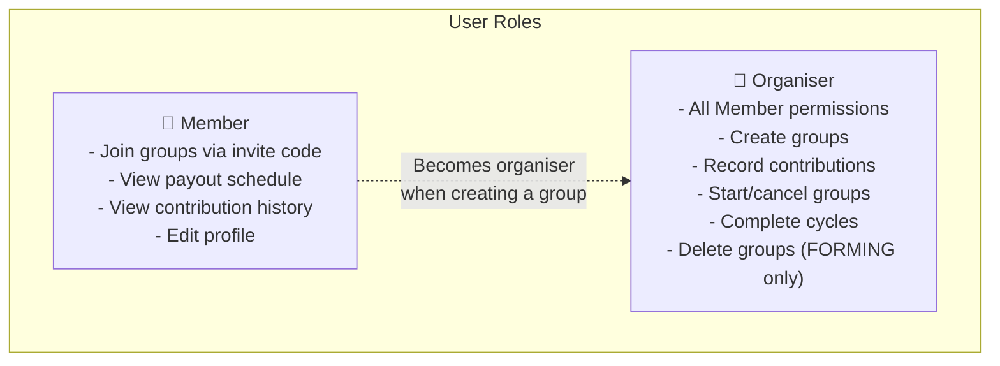
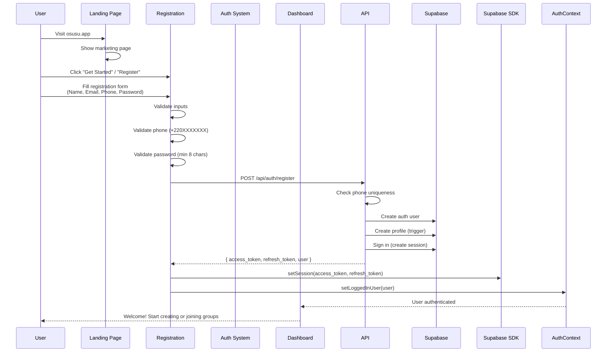
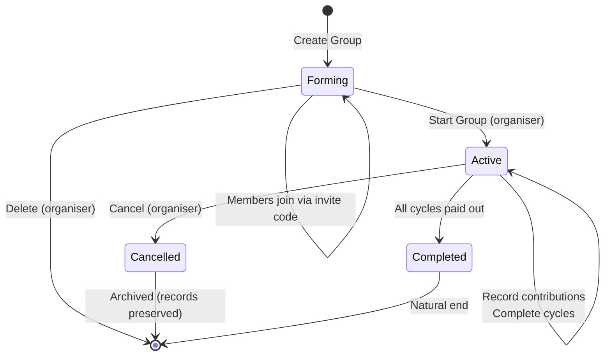
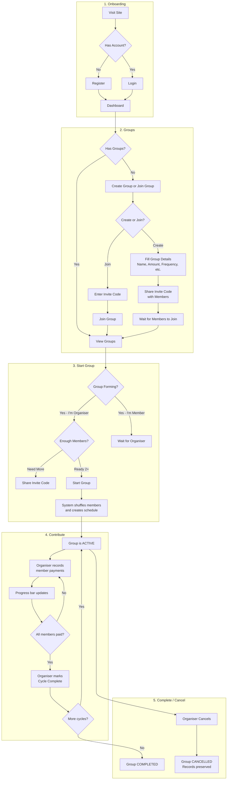
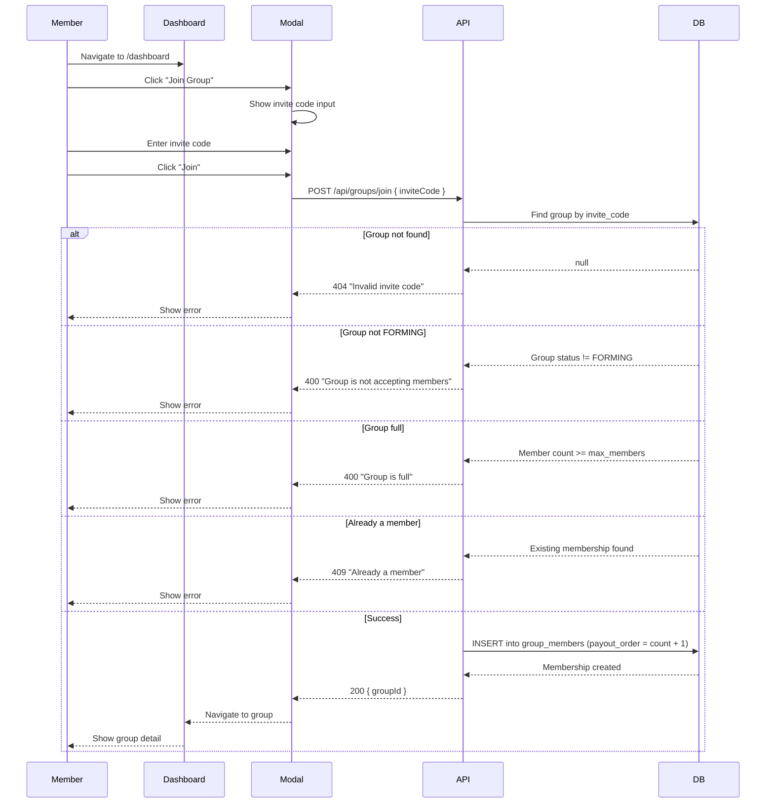
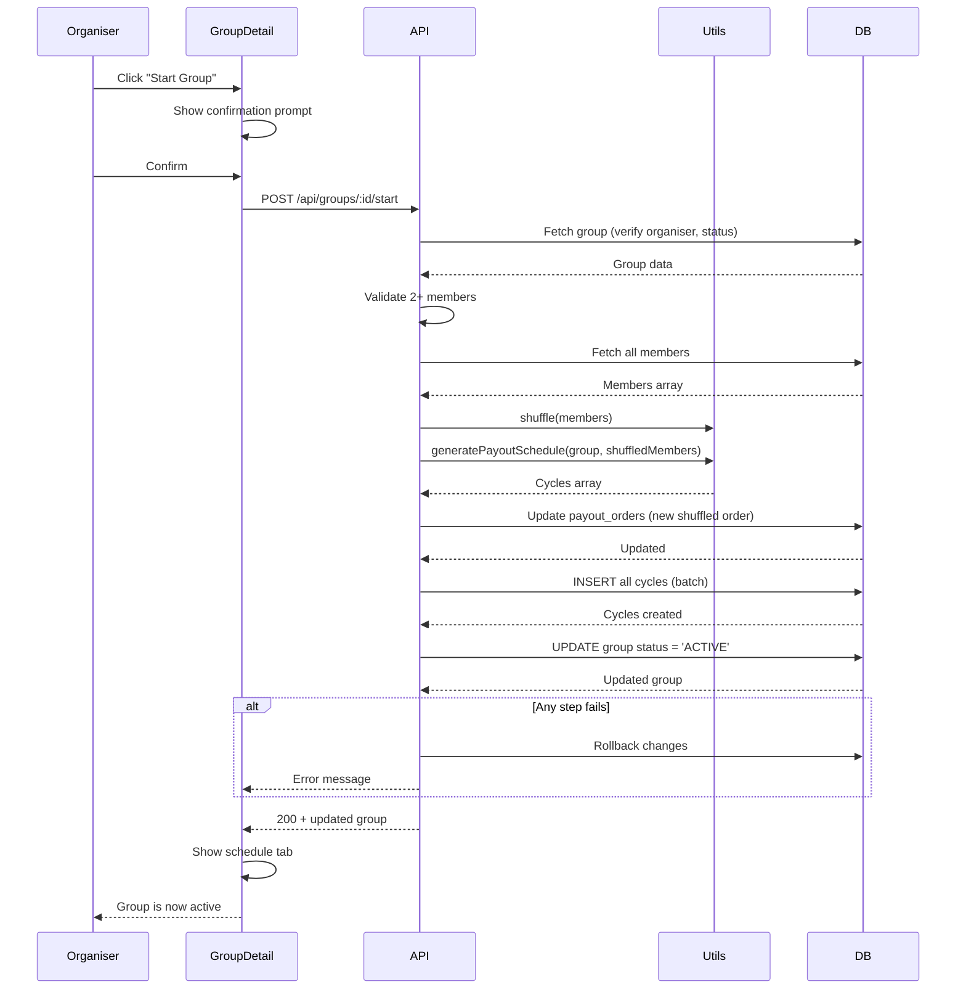
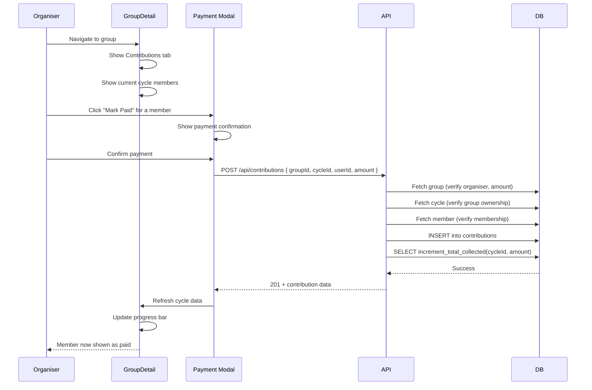
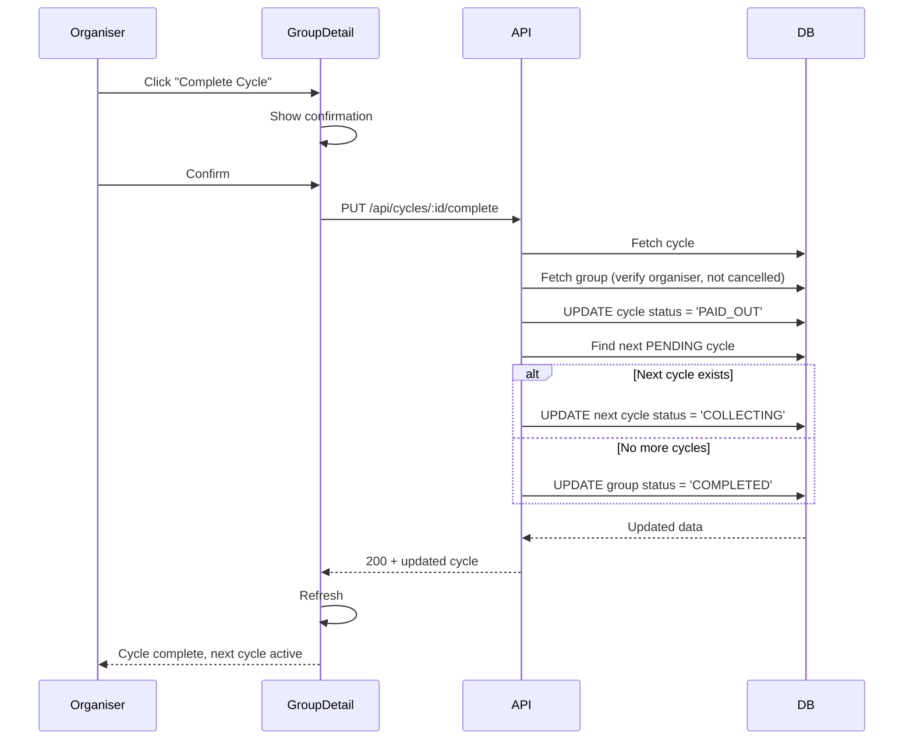

# Project Workflow

## Overview

This document describes the complete user workflows through the Osusu application, from initial registration through group lifecycle to contribution recording.

---

## User Roles



---

## User Registration and Onboarding



---

## Group Lifecycle



---

## Complete User Flow Map



---

## Detailed Workflows

### 1. Creating a Group

```mermaid
sequenceDiagram
    participant Organiser
    participant Create as CreateGroupPage
    participant API
    participant DB

    Organiser->>Create: Navigate to /groups/new
    Create->>Create: Show step 1: Basic Details
    Organiser->>Create: Enter: Name, Description, Amount
    Organiser->>Create: Click "Next"

    Create->>Create: Show step 2: Rules
    Organiser->>Create: Select: Frequency, Max Members, Start Date
    Organiser->>Create: Click "Next"

    Create->>Create: Show step 3: Review Summary
    Organiser->>Create: Click "Create Group"

    Create->>API: POST /api/groups
    API->>DB: INSERT into groups
    API->>DB: UPDATE profile → ORGANISER
    API->>DB: INSERT into group_members (payout_order=1)
    DB-->>API: Group with invite_code
    API-->>Create: 201 + group data

    Create->>Create: Show success screen with invite code
    Organiser->>Organiser: Copy invite code
    Organiser->>Organiser: Share code with friends
```

**Business rules enforced:**
- Group name: 3-60 characters
- Contribution amount: minimum 50
- Max members: 2-50
- Start date: must be today or in the future
- Creator automatically becomes organiser (role promoted from MEMBER)
- Creator is automatically added as member #1 (payout_order = 1)

### 2. Joining a Group



### 3. Starting a Group (Activation)



**What happens when a group starts:**
1. Members are shuffled using Fisher-Yates algorithm (unbiased random)
2. Each member gets a new `payout_order` (1 through N)
3. One cycle is created per member in payout order
4. First cycle immediately becomes `COLLECTING`
5. Group status updates to `ACTIVE`
6. If any step fails, all changes are rolled back

### 4. Recording Contributions



**Business rules enforced:**
- Only the group organiser can record contributions
- Contribution amount must match exactly `group.contribution_amount`
- Each member can contribute only once per cycle
- `total_collected` is updated atomically via PostgreSQL RPC
- Cannot contribute to a cancelled group

### 5. Completing a Cycle



### 6. Deleting vs Cancelling a Group

```mermaid
flowchart TD
    A[Organiser wants to end group] --> B{Group status?}
    
    B -->|FORMING| C[Hard Delete]
    C --> D[Group + members + related data<br/>permanently removed from database]
    D --> E[Member is notified group is gone]
    
    B -->|ACTIVE| F[Cancel (Soft Delete)]
    F --> G[Group status → CANCELLED]
    G --> H[All contribution records preserved]
    H --> I[Group appears under "Archived" in dashboard]
    H --> J[No further actions possible]
    
    B -->|COMPLETED| K[Group already ended naturally]
    K --> L[Permanently viewable, no actions available]
```

---

## Data Visibility Rules

| Data | Member | Organiser |
|---|---|---|
| Group name and details | ✅ Full view | ✅ Full view |
| Member list | ✅ All members visible | ✅ All members visible |
| Payout schedule | ✅ All cycles visible | ✅ All cycles visible |
| Contribution records | ✅ Own + aggregate totals | ✅ All member records |
| Organiser actions | ❌ Cannot access | ✅ Full control |
| Invite code | ❌ Hidden (unless organiser shared it) | ✅ Visible in group overview |
| Archived groups | ✅ Visible under "Archived" section | ✅ Visible under "Archived" section |
