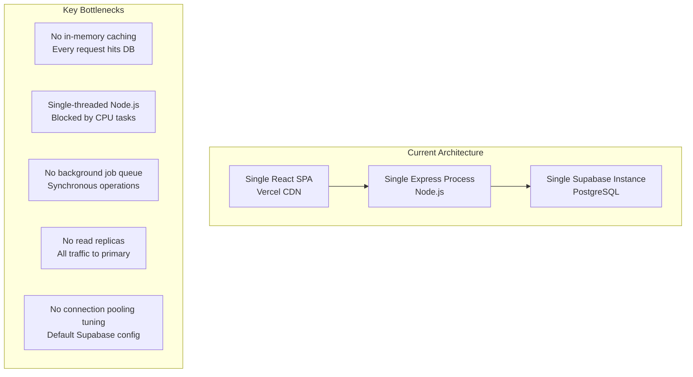
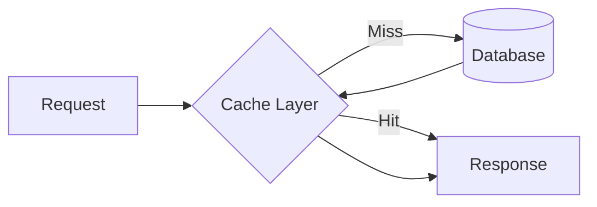
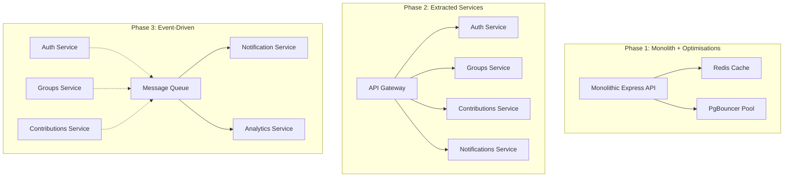
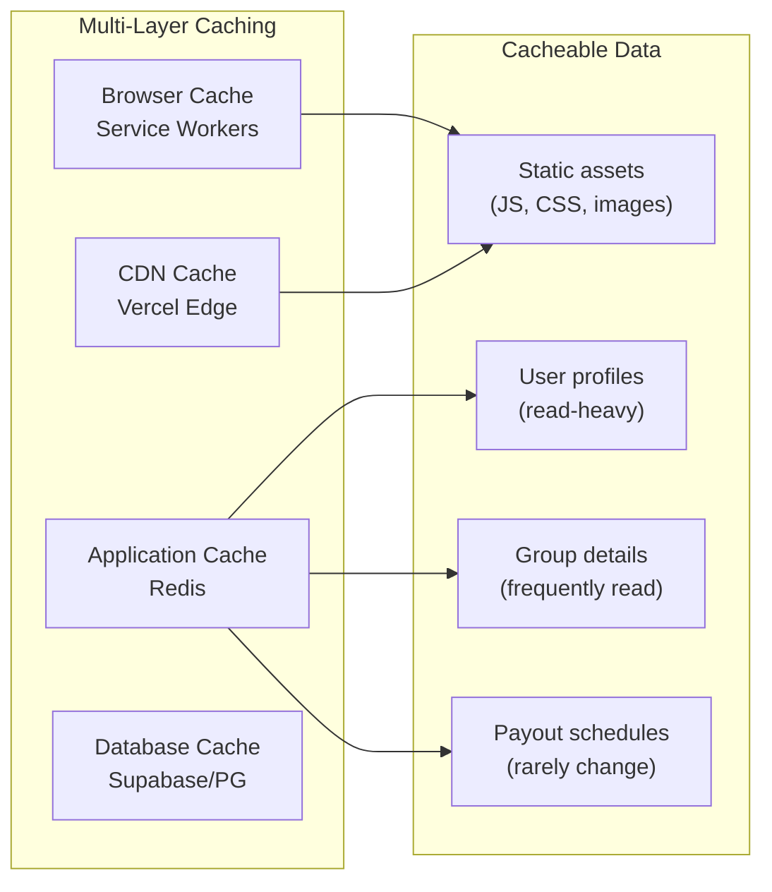

# Scalability Analysis

## Overview

This document analyses the current scalability characteristics of the Osusu platform and identifies bottlenecks, scaling strategies, and a migration path for future growth.

---

## Current Architecture Limitations



---

## Current Capacity Estimates

Based on the current architecture (Node.js single process, single PostgreSQL instance):

| Metric | Estimated Capacity | Limiting Factor |
|---|---|---|
| Concurrent users | 50-100 | Single Express process |
| Total users | 1,000-5,000 | Not user count (users do occasional requests) |
| Active groups | 500-1,000 | Database queries per operation |
| Requests per second | 50-100 | Express route handling |
| Database connections | 15-20 (Supabase free tier limit) | Connection pool size |
| Storage | 500MB - 8GB (Supabase free) | Contribution records growing over time |

---

## Identified Bottlenecks

### 1. No Caching Layer

**Problem:** Every API request hits the database directly. Frequently accessed data (group details, member lists, payout schedules) is fetched fresh on every page load.

**Impact:** Increased database load, higher latency for repeat requests.

**Solution:**


| Cache Target | TTL | Benefit |
|---|---|---|
| Group details | 30 seconds | Group detail page loads |
| Member lists | 60 seconds | Dashboard loads |
| Payout schedules | 5 minutes | Schedule tab loads |
| User profiles | 5 minutes | Navbar, profile page |

**Implementation options:**
- **In-memory (Redis):** 5-10ms latency, ephemeral, requires managed Redis
- **Supabase Edge Functions:** Built-in caching capabilities
- **Application-level:** Simple `Map` in Express process (memory-bound)

### 2. Synchronous Operations

**Problem:** All operations are synchronous — contribution recording, schedule generation, etc. Block the request/response cycle.

**Impact:** Users wait for all database operations to complete before receiving a response.

**Solution:** Background job queue for non-critical operations:

| Operation | Current | With Queue |
|---|---|---|
| Contribution recording | Synchronous (wait for DB + RPC) | Return immediately, queue atomic update |
| Group start (schedule generation) | Synchronous (members + cycles + status) | Return 202, process in background |
| Email notifications | Not implemented | Queue and batch send |
| Analytics updates | Not implemented | Queue and batch write |

### 3. Single Express Process

**Problem:** Node.js runs a single-threaded event loop. The current setup has one process handling all traffic.

**Impact:** CPU-intensive tasks (large group start with 50 members) block all other requests.

**Solutions by stage:**

| Stage | Approach | Complexity |
|---|---|---|
| **1** | Increase Node.js memory | Low |
| **2** | Cluster mode (PM2) — multiple processes on same machine | Medium |
| **3** | Multiple instances behind a load balancer | High |

### 4. Database Scaling

**Problem:** All read and write operations hit the same PostgreSQL instance.

```mermaid
graph TB
    subgraph Current["Single Database"]
        A[App Server] --> B[(Primary)]
    end

    subgraph Future["Read Replicas"]
        C[App Server] --> D[(Primary)]
        App Server --> E[(Read Replica 1)]
        App Server --> F[(Read Replica 2)]
        D -.->|Streaming Replication| E
        D -.->|Streaming Replication| F
    end
```

| Query Type | Current | With Replicas |
|---|---|---|
| Group lists (reads) | Primary | Read replica |
| Member lists (reads) | Primary | Read replica |
| Contribution recording (writes) | Primary | Primary |
| Group start (writes) | Primary | Primary |

---

## Scaling Strategy by User Tier

### Tier 1: Launch (0-500 users)

**Strategy:** Optimise the existing architecture.

| Action | Impact | Effort |
|---|---|---|
| Add database indexes (done — 6 existing) | Low | Already done |
| Implement basic in-memory caching | Low | 1-2 days |
| Add database connection pooling (PgBouncer) | Low | Config change |
| Enable HTTP/2 on Render | Low | Config change |

### Tier 2: Growth (500-5,000 users)

**Strategy:** Horizontal scaling and background processing.

| Action | Impact | Effort |
|---|---|---|
| PM2 cluster mode (4 processes) | Medium | 1 day |
| Redis caching layer (Upstash / Render Redis) | Medium | 2-3 days |
| Background job queue (Bull + Redis) | Medium | 3-5 days |
| Upgrade Supabase to Pro plan (more connections) | Medium | Config change |

### Tier 3: Scale (5,000-50,000 users)

**Strategy:** Multi-instance deployment and read replicas.

| Action | Impact | Effort |
|---|---|---|
| Multiple Express instances behind Render load balancer | High | 3-5 days |
| PostgreSQL read replicas (2-3) | High | 1-2 weeks |
| Database sharding or partitioning by region | High | 2-4 weeks |
| CDN caching for static responses | Medium | Config change |

---

## Database Scaling

### Query Optimisation

| Current Query | Issue | Optimisation |
|---|---|---|
| `getGroupById` — multiple single-table queries | N+1 pattern | Single query with joins |
| `getMyGroups` — join with group_members | Already optimised | Use existing index |
| Dashboard — 4 summary cards (4 separate queries) | Over-fetching | Single aggregation query |

### Indexing Strategy

Current indexes target the most common query patterns:

```sql
-- Already existing
idx_cycles_group_id        → cycles(group_id)
idx_cycles_group_status    → cycles(group_id, status)  -- composite
idx_contributions_cycle_id → contributions(cycle_id)
idx_contributions_group_id → contributions(group_id)
idx_group_members_group_id → group_members(group_id)
idx_group_members_user_id  → group_members(user_id)
```

**Proposed additional indexes:**

```sql
-- For dashboard queries
CREATE INDEX idx_groups_organiser ON groups(organiser_id);

-- For contribution history
CREATE INDEX idx_contributions_user_cycle ON contributions(user_id, cycle_id);

-- For group listing sorted by date
CREATE INDEX idx_groups_created ON groups(created_at DESC);
```

---

## Microservices Migration Path



### Service Boundaries

The current controller architecture already maps to natural service boundaries:

| Current Controller | Future Service | Responsibility |
|---|---|---|
| `auth.controller.js` | Auth Service | User management, JWT, profiles |
| `groups.controller.js` | Groups Service | Group CRUD, membership, lifecycle |
| `cycles.controller.js` | Cycles Service | Cycle management, state transitions |
| `contributions.controller.js` | Contributions Service | Payment recording, atomic operations |
| — | Notification Service | Email/SMS reminders, alerts |
| — | Analytics Service | Usage metrics, platform insights |

---

## Caching Strategy



| Cache Layer | Data | Strategy | Invalidation |
|---|---|---|---|
| Browser (Service Worker) | Static assets | Cache-first | Versioned builds |
| CDN (Vercel) | API responses | Time-based (TTL) | Deploy hook |
| Redis | User profiles, group details | Write-through | Direct invalidation on update |
| PostgreSQL | Default cache | Managed by Postgres | N/A |

---

## Horizontal Scaling Readiness

### Stateless Design

The Express API is **stateless** — no server-side sessions, no in-memory user state. This is the fundamental prerequisite for horizontal scaling.

| State | Where Stored | Scaling Impact |
|---|---|---|
| Auth tokens | In request headers | ✅ Stateless |
| Session data | Supabase SDK (browser) | ✅ Stateless |
| Business data | PostgreSQL | ✅ Shared database |

### What Needs Work

| Component | Current | For Horizontal Scaling |
|---|---|---|
| In-memory cache | None | Need Redis (shared) |
| Rate limiter | In-memory (process-local) | Need Redis-based (shared) |
| File uploads | None | Need S3-compatible storage |
| WebSocket | Not used | Need sticky sessions or pub/sub |
| Logging | Console + Morgan | Need centralised logging |

---

## Cost Projections

| Tier | Users | Server Cost/Month | Database Cost/Month | CDN Cost/Month | Total |
|---|---|---|---|---|---|
| MVP | 0-500 | $0 (Render Free) | $0 (Supabase Free) | $0 (Vercel Free) | $0 |
| Growth | 500-5K | $7 (Render Starter) | $25 (Supabase Pro) | $20 (Vercel Pro) | ~$52 |
| Scale | 5K-50K | $120 (Render 2x instances) | $100 (Supabase Team) | $200 (Vercel Team + Edge) | ~$420 |
| Enterprise | 50K+ | Custom | Custom | Custom | Custom |
