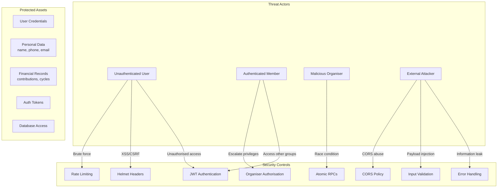
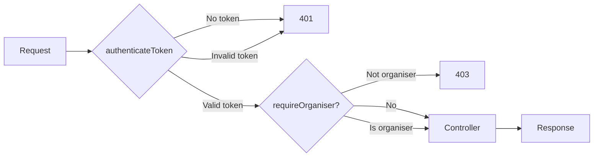

# Security Analysis

## Overview

This document analyses the security posture of the Osusu application, covering authentication, authorisation, data protection, and potential vulnerabilities. The analysis follows OWASP Top 10 classification where applicable.

---

## Threat Model



---

## Authentication (OWASP A1, A7)

### JWT Token Management

| Aspect | Implementation | Assessment |
|---|---|---|
| **Token generation** | Supabase Auth (standard JWTs) | ✅ Secure — tokens signed with Supabase's private key |
| **Token transport** | `Authorization: Bearer` header only | ✅ Secure — never in URLs or body |
| **Token verification** | `supabaseAdmin.auth.getUser()` on every request | ✅ Every request is independently verified |
| **Token expiry** | Supabase default (1 hour access token) | ✅ Short-lived with refresh token rotation |
| **Token storage (browser)** | Supabase SDK manages in memory + localStorage | ⚠️ Acceptable — SDK handles securely; not manual localStorage |

### Session Management

| Aspect | Implementation | Assessment |
|---|---|---|
| **Session creation** | `supabase.auth.setSession()` after login/register | ✅ Explicit, controlled sync |
| **Session restoration** | `getSession()` on page load | ✅ Uses Supabase SDK, not custom code |
| **Session expiry detection** | Axios response interceptor on 401 | ✅ Global, consistent handling |
| **Logout** | `supabase.auth.signOut()` + state clear | ✅ Complete session termination |

### Password Management

| Aspect | Implementation | Assessment |
|---|---|---|
| **Password storage** | Managed by Supabase Auth (bcrypt + salt) | ✅ Industry standard, not handled in app code |
| **Password change** | `supabaseAdmin.auth.admin.updateUserById()` | ✅ Requires authentication |
| **Password reset** | `supabaseAdmin.auth.resetPasswordForEmail()` | ✅ Secure, token-based |
| **Forgot password** | Always returns 200 (prevents enumeration) | ✅ OWASP best practice |

---

## Authorisation (OWASP A1)

### Route Protection



| Level | Enforced | Bypass Risk |
|---|---|---|
| **JWT verification** | `authenticateToken` middleware | Low — verified via Supabase Auth API on every request |
| **Organiser check** | `requireOrganiser` middleware | Low — fetches fresh data from DB per request |
| **Membership check** | `getGroupById` controller | Low — verifies membership in DB query |
| **Organiser verification (deleteContribution)** | Manual check in controller | Low — same logic as middleware, done for route compatibility |

### Service Role Key Implications

The server uses `SUPABASE_SERVICE_ROLE_KEY` for all database operations. This is a **deliberate architectural decision** with important security implications:

| Risk | Mitigation | Assessment |
|---|---|---|
| Key exposure | Never in frontend code, only in server `.env` | ✅ Properly isolated |
| Key compromise | Would grant full DB access | ⚠️ This is why `.env` is gitignored |
| RLS bypassed | Application-level auth in middleware | ✅ All authorisation happens in controllers |
| SQL injection | Supabase JS client uses parameterised queries | ✅ No raw SQL concatenation |

**Key insight:** Because the server fully controls access to the service role key, and all authorisation is implemented in application middleware, the risk is equivalent to using a direct database connection with application-level access control. The defence-in-depth RLS policies on each table provide an additional safety layer.

---

## Input Validation (OWASP A3)

### Validation Coverage

| Endpoint | Validation | Enforcement |
|---|---|---|
| Register | Phone format, all fields required, email format | Server-side regex + Supabase |
| Login | Email required, password required | Server-side check |
| Create Group | Name length, amount > 0, max members range | Server-side |
| Join Group | Invite code presence, group status, capacity | Server-side + DB query |
| Record Contribution | Amount match, cycle/group/user validity | Server-side + DB queries |
| Profile Update | Phone format (if provided) | Server-side |

### Request Size Limiting

`express.json({ limit: '10kb' })` prevents large payload attacks. Any request body exceeding 10KB is rejected before reaching controllers.

---

## Rate Limiting (OWASP A4)

### Auth Rate Limiter

```js
rateLimit({
  windowMs: 15 * 60 * 1000,  // 15 minutes
  max: 20,                     // 20 requests per window
})
```

| Attack Type | Effectiveness |
|---|---|
| Brute force login | ✅ Limited to 20 attempts per 15 minutes per IP |
| Credential stuffing | ✅ Effectively prevented |
| DoS via auth endpoints | ✅ Partially — but API rate limits aren't implemented on other routes |
| Forgot password spam | ✅ Limited to 20 requests per 15 minutes |

---

## Data Protection

### Transport Security

| Layer | Measure | Status |
|---|---|---|
| HTTPS | Enforced by hosting (Vercel, Render) | ✅ Production only |
| HTTP headers | `helmet()` middleware | ✅ Content-Security-Policy, X-Frame-Options, X-XSS-Protection, etc. |
| CORS | `cors({ origin: CLIENT_URL })` | ✅ Only the frontend origin is allowed |

### Database Protection

| Layer | Measure | Status |
|---|---|---|
| Column-level | Only necessary fields returned in responses | ✅ Response shaping in controllers |
| Atomic operations | RPC functions prevent race conditions | ✅ Financial data integrity |
| Cascading deletes | `ON DELETE CASCADE` on foreign keys | ✅ Clean removal of related data |
| Unique constraints | Prevent duplicate entries | ✅ Data integrity |

---

## Vulnerability Analysis

### Potential Vulnerabilities

| Vulnerability | Risk | Status | Explanation |
|---|---|---|---|
| **SQL Injection** | Low | ✅ Mitigated | Supabase JS client uses parameterised queries; no raw SQL in application code |
| **XSS** | Low | ✅ Mitigated | React's JSX auto-escapes output; Content-Security-Policy headers via helmet |
| **CSRF** | Low | ✅ Mitigated | CORS restricts origin; JWT in header (not cookie) means no automatic credential attachment |
| **JWT Theft** | Medium | ⚠️ Acceptable | Token stored in SDK-managed localStorage; compromised through XSS which is already mitigated |
| **IDOR** | Low | ✅ Mitigated | `getGroupById` checks membership; organiser routes check ownership |
| **Mass Assignment** | Low | ✅ Mitigated | Controllers explicitly select which fields to update |
| **Enumeration** | Low | ✅ Mitigated | Forgot password returns identical message; error messages are generic |
| **Race Condition (financial)** | Low | ✅ Mitigated | Atomic RPCs for `total_collected` updates |

### Service Role Key — Specific Risk Assessment

The use of `SUPABASE_SERVICE_ROLE_KEY` bypasses all Row Level Security. This is the most significant architectural security decision.

**Risk:** If an attacker gains access to the service role key, they have full administrative access to the database.

**Mitigations:**
1. The key is stored only in `server/.env` (gitignored)
2. Only the Express server process has access
3. The frontend never receives or references this key
4. All server endpoints are protected by authentication middleware
5. The key is passed to Supabase JS SDK, never used in raw HTTP calls
6. RLS policies exist as defence-in-depth

**Comparison with alternatives:**
- **Using anon key + RLS only:** Would mean RLS defines all access control, which is harder to test and debug than application-level middleware
- **Using a regular Supabase user:** Would require storing credentials server-side, adding complexity without meaningful security benefit

The current approach is a pragmatic trade-off that prioritises application-level control over database-level control, which is appropriate for an MVP.

---

## Security Headers Checklist

| Header | Set by helmet | Purpose |
|---|---|---|
| `Content-Security-Policy` | ✅ | Prevents XSS and data injection |
| `X-Content-Type-Options` | ✅ | Prevents MIME type sniffing |
| `X-Frame-Options` | ✅ | Prevents clickjacking |
| `X-XSS-Protection` | ✅ | Enables browser XSS filter |
| `Strict-Transport-Security` | ✅ | Enforces HTTPS |
| `Referrer-Policy` | ✅ | Controls referrer header |

---

## Security Recommendations

### Immediate (Low Effort, High Impact)

1. **Add rate limiting to all routes** — Currently only auth routes are rate-limited. Add global rate limiting and stricter limits on mutation endpoints.

2. **Implement request logging with security events** — Log failed login attempts, 403 responses, and invalid tokens for monitoring.

3. **Add Content Security Policy reporting** — Configure `report-uri` to catch XSS attempts.

### Short Term (Medium Effort)

4. **Add tamper detection** — Implement HMAC signing on contribution records to detect unauthorised modifications.

5. **Session invalidation on password change** — After password change, invalidate all existing sessions for that user.

6. **Audit log for sensitive operations** — Track who deleted what contribution and when.

### Long Term (High Effort)

7. **Implement proper RBAC** — Move from binary organiser/member roles to a proper role hierarchy with granular permissions.

8. **Database encryption at rest** — Enable PostgreSQL encryption for sensitive columns (phone numbers).

9. **Penetration testing** — Regular security audits as the platform scales.

10. **Two-factor authentication** — Add TOTP-based 2FA for organiser accounts handling large sums.
