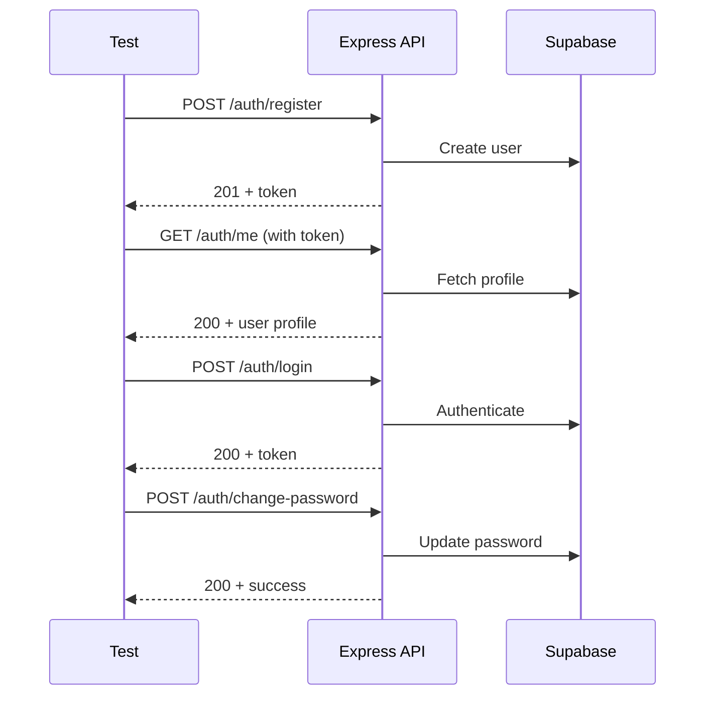
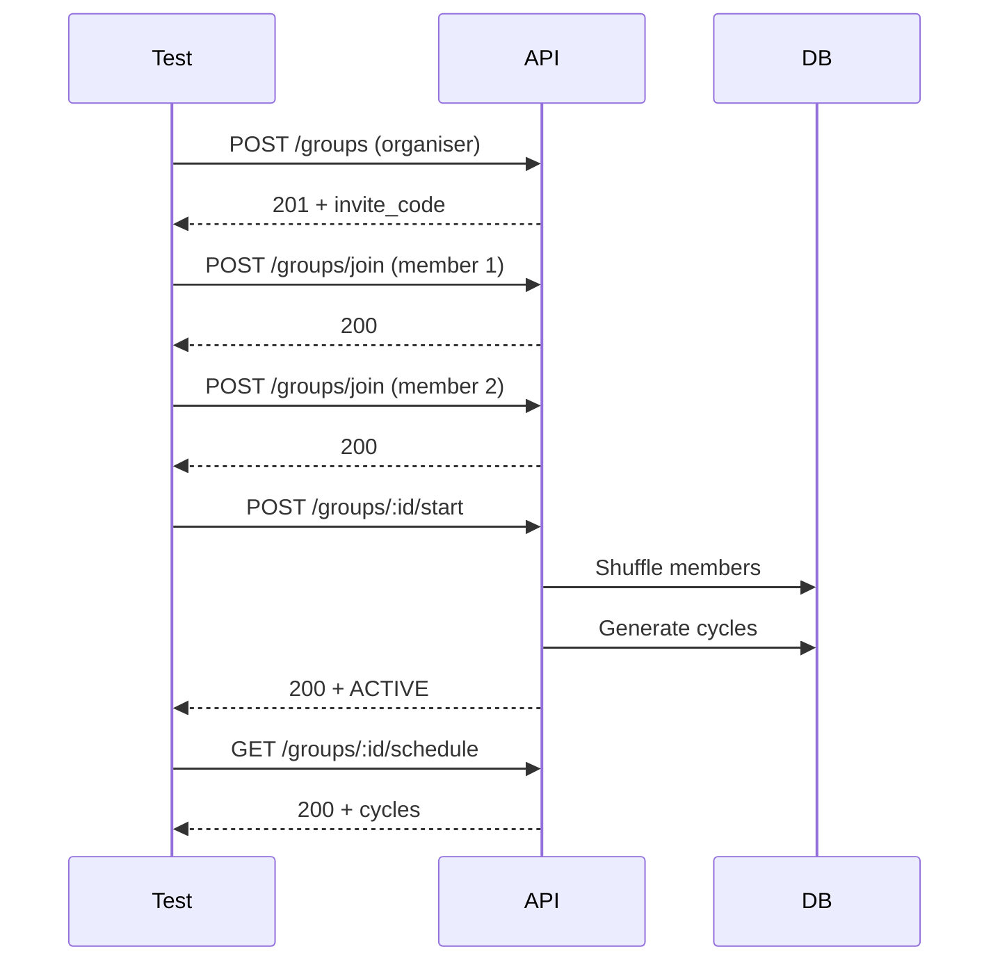
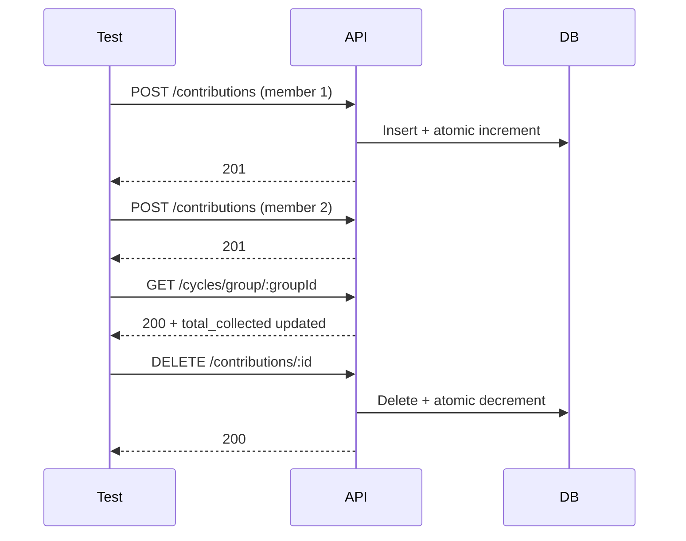

# Testing Strategy

## Current Status

**Osusu currently has no automated tests.** This document outlines the recommended testing strategy to be implemented.

The `server/package.json` has a placeholder test script:
```json
"test": "echo \"Error: no test specified\" && exit 1"
```

No test files exist anywhere in the project. The only testing to date is the manual test checklist in the build specification.

---

## Recommended Testing Stack

| Layer | Framework | Purpose |
|---|---|---|
| **Unit Tests (Backend)** | Vitest | Test controllers, utilities, middleware in isolation |
| **Integration Tests (Backend)** | Vitest + Supertest | Test API endpoints with database |
| **Unit Tests (Frontend)** | Vitest + React Testing Library | Test components, hooks, utilities |
| **E2E Tests** | Playwright | Full user flows in browser |
| **Visual Regression** | Storybook + Chromatic | UI component snapshots |

---

## Test Categories

### 1. Unit Tests — Backend

#### Utility Functions

**`server/src/utils/shuffle.js`**

| Test Case | Input | Expected |
|---|---|---|
| Returns same length array | 5 elements | 5 elements |
| Contains all original elements | [1, 2, 3, 4] | Same elements, any order |
| Produces different permutations | Run 100 times | Not all identical (statistical) |
| Empty array | [] | [] |
| Single element | [1] | [1] |

**`server/src/utils/generatePayoutSchedule.js`**

| Test Case | Input | Expected |
|---|---|---|
| Correct number of cycles | 5 members | 5 cycles |
| First cycle is COLLECTING | Any | `status === 'COLLECTING'` |
| Rest are PENDING | Any | `status === 'PENDING'` |
| Dates increment for WEEKLY | 7 days apart | Each due_date is +7 days |
| Dates increment for MONTHLY | 1 month apart | Each due_date is +1 month |
| Dates increment for DAILY | 1 day apart | Each due_date is +1 day |
| Total expected calculated correctly | amount=500, 5 members | Each total_expected = 2500 |

#### Controller Logic (Mocked Database)

**`auth.controller.js`**

| Test Case | Scenario |
|---|---|
| Register validates required fields | Missing fullName → 400 |
| Register validates phone format | Invalid phone → 400 |
| Register checks phone uniqueness | Existing phone → 409 |
| Login with valid credentials | Returns token + user |
| Login with invalid password | Returns 401 |
| Forgot password always returns 200 | Both valid and invalid emails |

**`groups.controller.js`**

| Test Case | Scenario |
|---|---|
| Create group sets organiser role | Profile updated to ORGANISER |
| Create group adds creator as member | Payout_order = 1 |
| Start group requires ≥2 members | 1 member → 400 |
| Start group validates status | Already ACTIVE → 400 |
| Start group with compensating rollback | Cycle insert fails → original orders restored |
| Delete only FORMING groups | ACTIVE → specific error message |
| Cancel only ACTIVE groups | FORMING → specific error message |

**`contributions.controller.js`**

| Test Case | Scenario |
|---|---|
| Create validates amount matches group | Mismatch → 400 |
| Create prevents duplicate per cycle | Same user + cycle → 409 |
| Create calls atomic increment | RPC invoked with correct params |
| Delete calls atomic decrement | RPC invoked with correct amount |
| Non-organiser cannot create | 403 returned |

**`cycles.controller.js`**

| Test Case | Scenario |
|---|---|
| Complete cycle auto-advances next | Next PENDING → COLLECTING |
| Complete last cycle completes group | Group status → COMPLETED |
| Complete cycle blocked for non-organiser | 403 returned |
| Complete cycle blocked for cancelled group | 400 returned |

### 2. Unit Tests — Frontend

#### Utility Functions

**`client/src/utils/helpers.js`**

| Test Case | Input | Expected |
|---|---|---|
| formatCurrency with integer | 500 | `"D 500.00"` |
| formatCurrency with decimal | 500.5 | `"D 500.50"` |
| formatCurrency with zero | 0 | `"D 0.00"` |
| formatDate | "2026-05-15" | `"15 May 2026"` |
| formatRelativeDate | Today | `"Today"` |
| formatRelativeDate | Tomorrow | `"Tomorrow"` |
| formatRelativeDate | Yesterday | `"Yesterday"` |
| formatRelativeDate | 3 days from now | `"In 3 days"` |

#### Components

| Component | Test Case | Scenario |
|---|---|---|
| **Button** | Renders children | Text content matches |
| **Button** | Shows spinner when loading | Loading state |
| **Button** | Disabled when loading | onClick not called |
| **Button** | Applies variant classes | primary/secondary/danger/ghost |
| **Input** | Shows label | Label rendered |
| **Input** | Shows error message | Error state |
| **Input** | Calls onChange | Input change handler |
| **Modal** | Shows content when open | isOpen = true |
| **Modal** | Calls onClose on backdrop | Click outside |
| **Modal** | Calls onClose on Escape | Key press |
| **Badge** | Correct colour for each status | FORMING/gray, ACTIVE/green, etc. |
| **EmptyState** | Shows title and description | Renders passed props |
| **GroupCard** | Shows group name | From props |
| **GroupCard** | Shows organiser badge | isOrganiser = true |

#### Pages

| Page | Test Case | Scenario |
|---|---|---|
| LoginPage | Shows error on invalid login | API returns 401 |
| LoginPage | Syncs token on success | supabase.setSession called |
| RegisterPage | Validates phone format | Invalid format shows error |
| RegisterPage | Validates password match | Mismatched passwords show error |
| DashboardPage | Shows loading state | Loading spinner visible |
| DashboardPage | Shows empty state | No groups |
| DashboardPage | Renders GroupCards | Groups in data |
| CreateGroupPage | 3-step wizard flow | Step navigation works |
| CreateGroupPage | Shows invite code on success | API returns group |

### 3. Integration Tests — API Endpoints

#### Auth Flow



#### Group Lifecycle



#### Contribution Flow



### 4. End-to-End Tests (Playwright)

#### User Registration Flow

```
1. Navigate to /
2. Click "Register"
3. Fill form: Musa Bah, musa@test.com, +2201234567, password123
4. Submit
5. Assert: redirected to /dashboard
6. Assert: Dashboard shows user name in navbar
```

#### Group Creation & Joining

```
1. Register User A (Organiser)
2. Click "Create Group"
3. Fill form: name, amount, frequency, members, date
4. Submit
5. Assert: Invite code displayed
6. Copy invite code
7. Log out
8. Register User B (Member)
9. Click "Join Group"
10. Paste invite code
11. Assert: Group appears in User B's dashboard
```

#### Contribution Recording

```
1. Register 3 users, create group, join with all 3, start group
2. Login as Organiser
3. Open group detail
4. Click "Contributions" tab
5. Click "Mark Paid" for User A
6. Assert: Progress bar updates
7. Click "Mark Paid" for User B
8. Assert: total_collected matches
9. Click "Mark Cycle Complete"
10. Assert: Cycle status → PAID_OUT
11. Assert: Next cycle → COLLECTING
```

---

## Test Implementation Priority

### Phase 1: Critical Path (Week 1)

| Priority | Tests | Why |
|---|---|---|
| P0 | Utility functions (shuffle, payout schedule, helpers) | Core business logic, no external dependencies |
| P0 | Auth controller (register, login, phone validation) | Authentication is the security boundary |
| P1 | Contribution controller (create, delete, atomic ops) | Financial data integrity |
| P1 | API health check + basic auth smoke test | Ensure server serves requests |

### Phase 2: Core Logic (Week 2)

| Priority | Tests | Why |
|---|---|---|
| P1 | Groups controller (start group, compensating rollback) | Most complex business logic |
| P1 | Cycles controller (complete cycle, auto-advance) | State machine correctness |
| P2 | Login/Register page component tests | Auth UX is critical path |

### Phase 3: Full Coverage (Week 3)

| Priority | Tests | Why |
|---|---|---|
| P2 | All remaining controllers | Complete coverage |
| P2 | All common components (Button, Input, Modal, etc.) | Reusable component reliability |
| P3 | All pages | Full frontend coverage |
| P3 | E2E smoke test (Playwright) | User flow validation |

---

## Testing Configuration

### Backend Test Setup (Vitest)

```js
// server/vitest.config.js
import { defineConfig } from 'vitest/config';

export default defineConfig({
  test: {
    environment: 'node',
    globals: true,
    setupFiles: ['./src/test/setup.js'],
  },
});
```

### Frontend Test Setup (Vitest + React Testing Library)

```js
// client/vitest.config.js
import { defineConfig } from 'vitest/config';
import react from '@vitejs/plugin-react';

export default defineConfig({
  plugins: [react()],
  test: {
    environment: 'jsdom',
    globals: true,
    setupFiles: ['./src/test/setup.js'],
  },
});
```

### Test Scripts

```json
// server/package.json
{
  "scripts": {
    "test": "vitest run",
    "test:watch": "vitest",
    "test:coverage": "vitest run --coverage"
  }
}

// client/package.json
{
  "scripts": {
    "test": "vitest run",
    "test:watch": "vitest",
    "test:coverage": "vitest run --coverage"
  }
}
```

---

## Manual Test Checklist

The following manual test checklist should be run before every major release:

### Auth
- [ ] Register a new account → redirected to dashboard
- [ ] Register with the same email → friendly error shown
- [ ] Register with the same phone → friendly error shown
- [ ] Login with wrong password → friendly error shown
- [ ] Refresh the page while logged in → still logged in
- [ ] Logout → redirected to login; back button doesn't show dashboard

### Groups
- [ ] Create a group → invite code displayed
- [ ] Second user joins using invite code → appears in members
- [ ] Cannot join the same group twice → friendly error
- [ ] Group created with invalid data → validation errors shown
- [ ] Start Group with 1 member → blocked with message
- [ ] Start Group with 2+ members → status changes to ACTIVE

### Contributions
- [ ] Organiser records a payment → member row turns green, total updates
- [ ] Cannot record same member twice in one cycle → friendly error
- [ ] Non-organiser cannot see the Mark Paid button
- [ ] Mark Cycle Complete → status updates to PAID_OUT

### Schedule
- [ ] Correct number of cycles (one per member)
- [ ] Dates increment correctly per frequency
- [ ] Each cycle shows the correct recipient name
- [ ] Completed cycles show PAID_OUT badge

### Mobile
- [ ] All pages usable at 375px width (no horizontal scroll)
- [ ] All buttons tappable, forms work with keyboard
- [ ] Tables scroll horizontally on small screens
